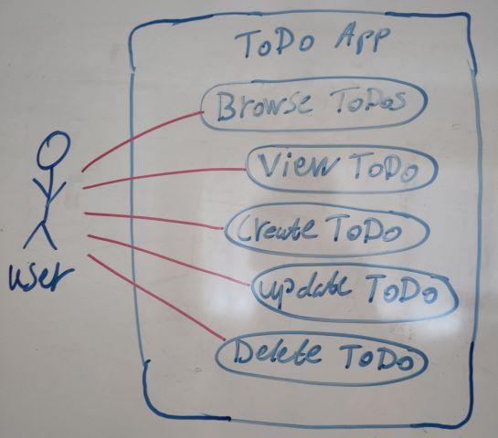
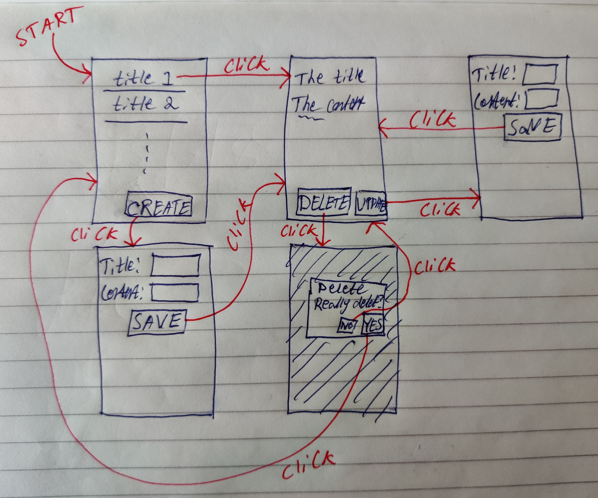

# Laboratory Work
On this page you find information about the examination test `Laboratory Work`.

<CompactInfo :infoPieces='{
    "Number of credits": "1.5",
    "Grades": ["Fail", "Pass"],
    "How to work": "Individually",
    "Goal": "To learn the basics of implementing graphical user interfaces using Jetpack Compose.",
    "Instructions": "Complete and present your solution to the lab described on this page to a teacher at a lab session.",
    "Help": "Ask the teacher for help at the lab sessions."
}'>
</CompactInfo>

::: warning Help, don't cheat!
The laboratory work is individual work.

**It is OK to help each other**. Examples of that:

* help your friend to debug his code
* explain to your friend why his code doesn't work the way he thinks it works
* compare and discuss different solutions to a lab problem with your friend after both of you have solved the lab to figure out which solution is the best one

**It is NOT OK to cooperate in any way**. Examples of that:

* sit at the same computer and write code together with your friend
* sit at different computers and discuss and write the same code as your friend
* give code to/receive code from your friend

**You must write your own code! If you are unsure about what counts as *helping* and what counts as *cheating*, then simply work alone and ask only the teacher at the lab sessions for help.**
:::


## Installing Required Software
In this course, we will only use Android Studio and the tools that come with it to create Android applications. We also recommend students to use Git while working on their projects, but that is not a requirement. All software we use in this course is available for free for both Windows, Mac and Linux.

**If you work on a computer in one of the rooms we have lab sessions in**, Android Studio and Git should already be installed for you, so no need to install anything yourself.

**If you work on a school computer in any other room**, you need to manually install Android Studio (and Git, if you want to use it) through the *Software Center* application (unless someone already has done that on the specific computer you are using).

**If you work on your own private computer**, you need to download and install [Android Studio](https://developer.android.com/studio/index.html) (and [Git](https://git-scm.com/), if you want to use it) yourself. 

To test the android applications you create, you need to run them on an Android device. If you have your own smartphone or tablet running Android you can use that one, just connect it to your computer using a USB cable.

::: tip For Windows users
On Windows you need to [Install OEM USB drivers](https://developer.android.com/studio/run/oem-usb.html) to be able to install Android applications on your connected Android device.
:::

To more easily debug applications when they run on your own Android device, you need to [Configure on-device developer options](https://developer.android.com/studio/debug/dev-options.html) (do the *Enable USB debugging on your device* thing).

If you don't have your own Android device to run your Android applications on, you can use an Android emulator that comes with Android Studio. If the emulator has not automatically been configured to take advantage of VM acceleration when Android Studio was installed, we highly recommend you to configure it to take advantage of the speed improvements (so the emulator lag less) by [Configuring VM acceleration](https://developer.android.com/studio/run/emulator-acceleration#accel-vm) (has already been configured on the school's computers). This is a good idea even if you have a physical Android device to test on, because you probably want to test run your Android applications on different versions of Android, different screen sizes, etc., which is easy to do on an emulator, but impossible to do on a physical device.

::: warning Note!
Getting VM acceleration to work is sometimes hard. If your emulator for some reason can't use it, it is often hard to debug. For example, you might get the error message `This computer meets requirements for HAXM, but VT-x is not turned on`, and the problem could be that [an antivirus program on your computer doesn't allow it to be used](https://stackoverflow.com/questions/21635504/error-during-installing-haxm-vt-x-not-working). Your development experience will be much better if you manage to enable VM acceleration, but it's probably not worth spending 20 hours on trying to get it to work. If you can't get it to work on your own computer, then stick to using the school's computers.
:::

::: warning Note!
To the students who take the *Web Development - Advanced Concepts* course.

Docker uses Virtual Machine Acceleration too, and both Docker and the Android Emulator can't use it at the same time.
:::

Android Studio often reads from and writes to many files, such as when you create a new Android Studio project or when you build your application. To be efficient, it's important that reading from and writing to files is fast. There are some known cases slowing down this process, such as:

* Antivirus programs you have installed
* Windows Defender
* Windows File Indexing

Nowadays Android Studio might install exceptions to these programs automatically when you install Android Studio, improving the build performance, but if Android Studio is slow, you might want to investigate this.

::: tip For Windows users
You can often find out what's slowing down Android Studio by using the [Task Manager](https://www.howtogeek.com/108742/how-to-use-the-new-task-manager-in-windows-8/) to find the process that allocates much of your computer resources when Android Studio is slow, and then try to configure it to ignore Android Studio's folders. For example, see [configure Windows Defender and Windows File Indexing to ignore Android Studio folders](https://stackoverflow.com/a/49336163/2104665).
:::

A fast CPU and an SSD instead of an HDD will of course also make Android Studio run faster as well; running Android Studio on a weak laptop usually gives you a very bad development experience. 


## Learning the basics
There are many things you need to learn before you will be able to understand how a basic Hello World program in Android works. Therefore we recommend you to start by doing things in the following order:

1. **Learn the basics in Kotlin**\
View the lecture on [Kotlin](../../lectures/kotlin/) and read/take a look at the recommended reading material there. 
2. **Setup a minimal Android Jetpack Compose app**\
Create a new Android Studio project per the instructions [Create a new app with support for Compose](https://developer.android.com/jetpack/compose/setup)
3. **Learn the basics in Jetpack Compose**\
The website [jetpackcompose.net](https://www.jetpackcompose.net/) has many good and simple examples of how to use the most commonly used Jetpack Compose components. We recommend you to checkout those examples, and at the same time experiment with using the components you learn there in the Android Studio project you created before.\
If you prefer to learn by watching videos, you can instead checkout the following code labs at Android Developers:
    1. [Jetpack Compose basics](https://developer.android.com/codelabs/jetpack-compose-basics)
    2. [Basic Layouts in Compose](https://developer.android.com/codelabs/jetpack-compose-layouts)
    3. [State in Jetpack Compose](https://developer.android.com/codelabs/jetpack-compose-state)
4. **Learn how to use `NavHost`**
    1. [Navigating with Compose](https://developer.android.com/jetpack/compose/navigation)

In addition to this, the tutorials given by the teacher in the course will help you to learn what you need to know to pass this lab.

::: tip More learning material
If want more learning material than the ones mentioned above, checkout the GitHub repository [androiddevnotes/awesome-jetpack-compose-learning-resources](https://github.com/androiddevnotes/awesome-jetpack-compose-learning-resources), which list videos, websites, slides, etc. with information about Jetpack Compose.
:::


## The Assignment
Your task is to implement an Android ToDo app (an app a user can use to keep track of things she needs to do) containing the functionality shown in <FigureNumber /> below.

<Figure caption="Use-case diagram showing the functionality in the ToDo app.">



</Figure>

It is up to you to specify what data a ToDo item should contain, but it needs to contain at least a title (a short description) and content (a longer description). Feel free to add more information to it if you want, such as:

* Has the ToDo item been carried out yet or not?
* How long time is it estimated to take to carry out the ToDo item?
* When is the deadline to have carried out the ToDo item?
* Which importance level (e.g. `Important`, `Medium`, `Not Important`) does the ToDo item have?
* Etc.

It is up to you to decide what the graphical user interface should look like, but it can look like something as shown in <FigureNumber /> below.

<Figure caption="Example of what the GUI can look like.">



</Figure>


## Requirements
The following requirements exist for the ToDo app:

* The app must implement functionality enabling users to do all the use-cases in the use-case diagram above
* When creating and updating a ToDo item, you must use validation:
    * The ToDo item should only be created/updated if no validation errors exist
    * If validation errors exists, display them as descriptive error messages on the screen to the user
    * You must have at least 3 different validation rules. Use whichever you want, but they can for example be:
        * The title have to contain at least 3 characters
        * The title have to contain at most 50 characters
        * The content have to contain at most 120 characters
* When updating a ToDo item, the fields where the user can change the text should be pre-populated with the old values in the ToDo item
* The back navigation must always make sense (especially after you have created, deleted or updated a ToDo item)
* The user can always properly use the GUI no matter:
    * How small screen the user has
    * How long text the ToDo items contain
    * How many ToDo items there are
    * Etc.

## Guidelines for getting started
If you want, feel free to try and implement the app from scratch yourself. Otherwise, this sub-chapter contains some instructions that can help you get started.

::: tip Use Git!
You don't have to use Git in this `Laboratory Work`, but we strongly recommend you to, because most likely you will be using Git in your `Project Work`, and it's good if you have some experience of using it before that. Here we provide you with some instructions on how to get started using Git:

1. If you don't have a [GitHub](https://github.com/) account, create a new one
2. Create a new Git repository on GitHub (be sure the repository is private, otherwise you risk other students will copy your work, and then both of you will be reported to DAN for cheating)
3. Clone the GitHub repository to your own computer using the `git clone ...` command
4. The Android Studio project that you will create per the instructions below, place it in the root folder of your local repository
5. Implement all functionality for one use-case at a time. When you are done with the functionality for a use-case, create a new commit in your local repository, and then push that commit to the repository on GitHub
:::

1. Create a new Android Studio project that makes use of Jetpack Compose (use the template *Empty Compose Activity*)
2. Add support for using [NavHost](https://developer.android.com/jetpack/compose/navigation#setup)
3. Create a [Kotlin Data Class](https://kotlinlang.org/docs/data-classes.html) to specify what properties a ToDo item should contain (at least title and content). It is also good if it contains an `id` property, which is a number that uniquely identifies it (the first ToDo item has id `1`, the second one has id `2`, and so on)
4. Create a Kotlin `ToDoRepository` class that can be used to store all ToDo items in a list. Then also create a new instance of it, and store it in a global variable. It is through that global variable the GUI later will be able to access the data it needs to display. You can use the code below to get started:

```kotlin
// Global variable used to store all ToDos.
val toDoRepository = ToDoRepository().apply {
    // Let's add two initial ToDos (to facilitate testing)
    addToDo(
        "Feed the pets",
        "Give the cat a fish and the dog a cat."
    )
    addToDo(
        "Exercise",
        "Take a walk and listen to music."
    )
}

class ToDoRepository{
    
    private val toDos = mutableListOf<ToDo>()
    
    fun addToDo(title: String, content: String): Int{
        val id = when {
            toDos.isEmpty() -> 1
            else -> toDos.last().id + 1
        }
        toDos.add(ToDo(
            id,
            title,
            content
        ))
        return id
    }
    
}
```

::: warning About storing data
Storing data in a global variable like this is not appropriate in this case, because when the app stops running, the ToDo items will be lost. Data like this is better stored in the built in supported SQLite database, but to simplify this lab (which primarily is about practising on implementing graphical user interfaces using Jetpack Compose) we will instead store the ToDo items in a global variable.
:::

5. Pick a use-case from the use-case diagram earlier on this page to implement next. Here is a suggestion in which order to implement the use-cases:
    1. Browse ToDos
    2. View ToDo
    3. Create ToDo
    4. Delete ToDo
    5. Update ToDo
6. Implemented the use-case you selected in its own Jetpack Compose component. Use `NavHost` to display one of your Jetpack Compose components at a time. For the Jetpack Compose components that should work with a single ToDo item, pass along the id of the ToDo item to them (learn more about that in [Navigate with arguments](https://developer.android.com/jetpack/compose/navigation#nav-with-args))
    1. In you own Jetpack Compose component, you will need to be able to get/change the ToDo items in your `ToDoRepository`. Add methods to the `ToDoRepository` to do this. For example:
        * Your Jetpack Compose component that implements the use-case *Browser ToDos* needs to retrieve all ToDo items from the repository, so add a method named `getAllToDos()` to your `ToDoRepository`
        * Your Jetpack Compose component that implements the use-case *View ToDo* needs to retrieve a ToDo item with a specific id from the repository, so add a method named `getToDoById(id)` to your `ToDoRepository`
        * Etc.
7. Restart on (5) until you have implemented all use-cases. If you use Git, don't forget to create and a push a new commit after you're done implementing each use-case!


## Present your work
Double check that your app fulfills the [Requirements](#requirements). Then present your work to a teacher at one of the lab sessions. You should be able to explain how all code you have written works, and the teacher will ask you some questions about it to verify that this is the case. If the teacher is satisfied with your presentation he will approve you on the Canvas assignment [Laboratory Work Presentation](https://ju.instructure.com/courses/6658/assignments/43129). After that, upload your project to the Canvas assignment [Laboratory Work Code](https://ju.instructure.com/courses/6658/assignments/43130).
