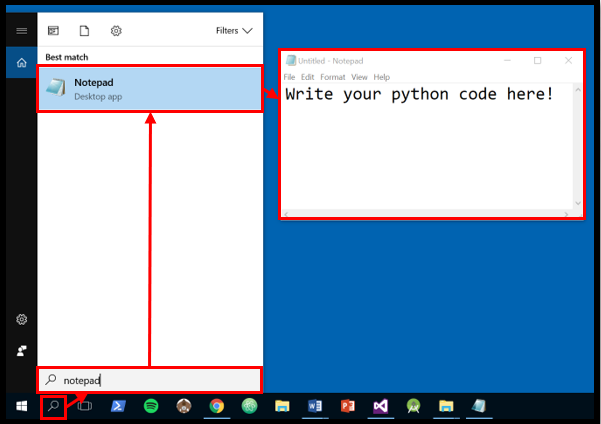
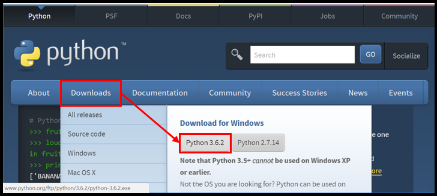
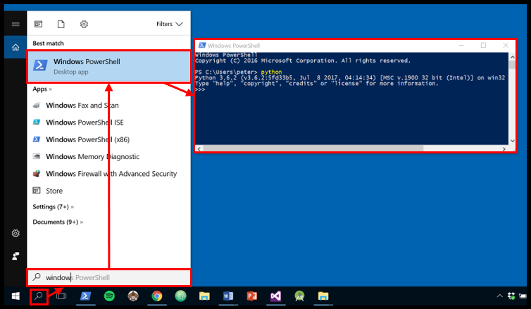
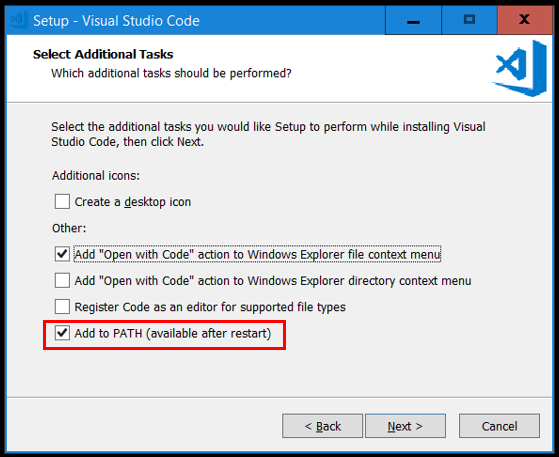
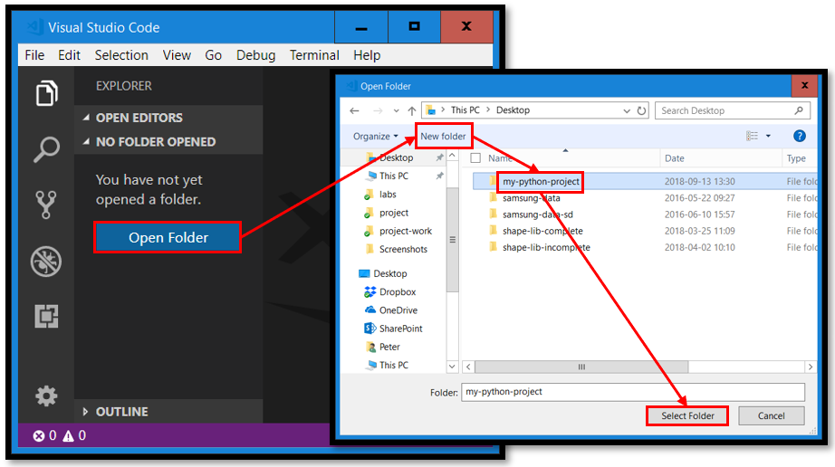
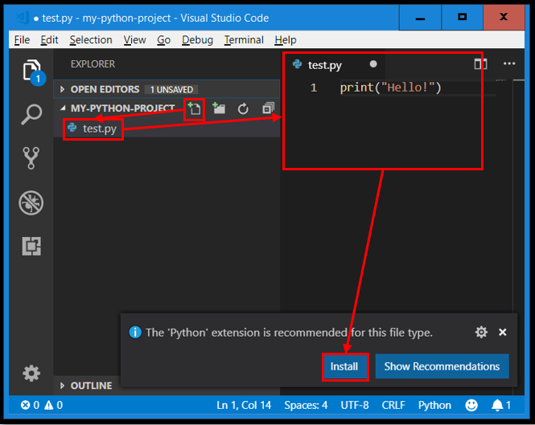
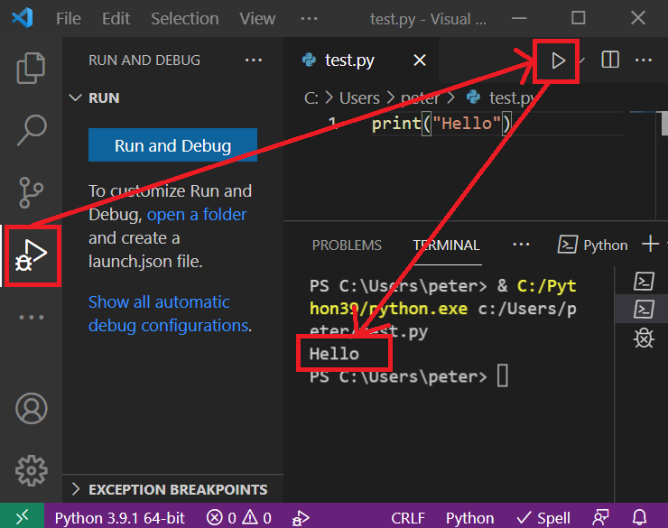

<SetTitle title="Introduction to Script Programming 2021" />

# Exercises
On this page you find information about the exercises in the course.

## Introduction
The exercises are not part of any examination test and therefore not mandatory to complete. They consist of programming problems that are a bit easier to solve than the labs, so they serve as good practice problems to solve before attempting to solve the labs.

Solutions to the exercises will be shown on this page after the tutorial each week going through and discussing sample solutions. 

## Getting started with Python
This sub-chapter contains instructions to help you get started with writing and running Python code. All software we use in this course should already be installed on the school's computers (but versions might differ). If you use your own computer, you need to install the software on your own computer yourself, as described further down in this sub-chapter.

To write Python code on your computer, you need a *text editor*. A text editor is a program through which you can:

1. Open any type of file on your hard drive.
2. Display the raw content of a file.
3. Change the content of a file in the text editor.
4. Save changes made to a file in the text editor back to the hard drive.

More or less all operating systems (Windows, Linux, Mac, etc.) come with a text editor pre-installed. For example, Windows comes with a text editor called *Notepad* (*Anteckningar* in Swedish), as shown in <FigureNumber /> below.

<Figure caption='The Notepad program can be found in Windows by searching for "Notepad".'>



</Figure>

These text editors work fine, and you may use them in this course if you want to. Just make sure to save your code in a file with the extension `.py`. But we recommend you to use an Integrated Development Environment (IDE) instead, as described further down in this sub-chapter. IDEs usually makes it much easier to read, write and run code.

To run Python code, you need to install the `python` program. The `python` program will simply take the code you have written in a file and execute it for you. The latest version of the `python` program can be downloaded and installed from [python.org](https://www.python.org). Install the version of Python beginning with 3, as shown in <FigureNumber /> below (available for Windows, Mac and Linux).

<Figure caption="Downloading the Python program. Make sure to use the version beginning with 3.">



</Figure>

The `python` program can be installed by running the installation program you downloaded. When you run it, make sure to check the option `Add Python 3.X to PATH`, as shown in <FigureNumber /> below. Checking this will make it easier to run the Python program from a shell/terminal/console. Click on `Install Now` to start the installation process.

<Figure caption="Running the Python installation program.">


</Figure>

To run the Python program, you just need to type `python` in a shell/terminal/console and then press the enter key. In Windows, you can use *Windows PowerShell* for this. Windows PowerShell can easily be started by searching for it, as shown in <FigureNumber /> below. 

<Figure caption="Running the Python program using Windows PowerShell.">



</Figure>

Just running the `python` command will start Python's read-eval-print-loop, where you can enter Python code and have it executed when you press the enter key, but the `python` command can also be used to execute Python code written in a file. How to do that is not explained here, but in the lecture [Python Introduction](../../lectures/python-introduction/).

You do not need to do anything more than this to start writing and running Python code, so it is quite easy to get started. But back to that IDE we mentioned earlier.

*Visual Studio Code* is an IDE you can use to write and run your Python code. Some of the benefits with this IDE compared to doing as described above are:

* Syntax highlighting of code, making it easier to read the code and to discover mistakes.
* Automatic indentation, so you do not need to enter spaces/tabs for indentation yourself.
* Run button, which makes it very easy to run your Python code.
* Debug capabilities making it easy to figure out why the code does not work the way you want it to.

Visual Studio Code (available for Windows, Mac and Linux) can be downloaded and installed for free from [code.visualstudio.com](https://code.visualstudio.com), as shown in <FigureNumber /> below.

<Figure caption="Downloading Visual Studio Code.">


</Figure>

Install Visual Studio Code by running the installation program you just downloaded. During the installation process, check the option `Add to PATH`, as shown in <FigureNumber /> below. This will make it possible to start Visual Studio Code from a shell using the `code` command. Feel free to check the other options if you want.

<Figure caption="Installing Visual Studio Code.">



</Figure> 

When the installation process has completed, start Visual Studio Code and open a new project folder you can use to store your Python files in, as shown in <FigureNumber /> below.

<Figure caption="Creating a new project folder in Visual Studio Code.">



</Figure>

Then create a new Python file in your project folder, as shown in <FigureNumber /> below.

<Figure caption="Creating a new Python file in Visual Studio Code and installing the Python extension.">



</Figure>

The first time Visual Studio Code encounters a Python file, it will suggest you install an extension to it containing features for working with Python files. Install that extension. You should then be able to run your Python code by clicking on the green DEBUG button shown in <FigureNumber /> below.

<Figure caption="Running Python files in Visual Studio Code.">



</Figure>

That's it! Now you can write your Python code in files using Visual Studio Code and then click on the green DEBUG button to run it.

## Exercise 0: Input & output
Before you start working on these exercises, you are recommended to watch the following recorded lectures:

* [Introduction to Computers and Programming](../../lectures/introduction-to-computers-and-programming/)
* [Using Shells](../../lectures/using-shells/)
* [Python Introduction](../../lectures/python-introduction/)
* [Python Basics - Part 1](../../lectures/python-basics-part-1/)

---

In these exercises you will practice on using the following in Python:

* Statements
* Expressions
* Values
* Variables
* Reading input from the user running your program
* Printing output to the user running your program

::: warning Note!
There is no Lab 0; Exercise 0 and Exercise 1 will both prepare you for Lab 1.
:::

### Problem 0.1: Producing output
The circumference of a circle can be computed with the formula `2*r*𝜋`, where:

* `r` is the radius of the circle.
* `𝜋` is `3.14`.

Create a program in a file called `circle-circumference-computer.py` that computes the circumference of a circle with the radius `7` and then prints the circle's circumference.

When you are done, the output of the program should be as shown in <FigureNumber /> below (if `𝜋` is `3.14`).

<Figure caption="The output the program should produce.">

```
This program computes the circumference of a circle.
The circumference of a circle with radius 7 is 43.96.
```

</Figure>

::: tip Tips
Here are some code pieces hinting about what you need to use to implement the program:

* `str(123)` to convert the number `123` to the string `"123"`.
* `"abc" + "def"` to create the string `"abcdef"`
* `print("Hello")` to print the string `"Hello"` followed by a line break to the console.
:::

::: danger Don't!
A program producing the output in <FigureNumber previous /> above can be implemented like this:

```python
print("This program computes the circumference of a circle.")
print("The circumference of a circle with radius 7 is 43.96.")
```

But this is of course not acceptable, because then *you* have computed the circumference. Instead, it's the computer that should compute the circumference. If you implement your program in a good way, changing the `7` at *one place* in your code to `14` would produce the correct output for the radius `14` (you should not need to change the `7` to `14` at multiple places in your code).
:::

#### Sample answer
<SampleAnswer :showAfter="$frontmatter.exercise0ShowAfter">

```python
print("This program computes the circumference of a circle.")
radius = 7
pi = 3.14
circumference = 2*radius*pi
print("The circumference of a circle with radius "+str(radius)+" is "+str(circumference)+".")
```
</SampleAnswer>

### Problem 0.2: Reading input
Even if the program created in Problem 0.1 works, it is not that useful because it computes and displays the same output each time you run the program. It is an example of a program that doesn't receive any input; it only produces output, as shown in <FigureNumber /> below.

<Figure caption="Visualization of how the program from Problem 0.1 works.">
<Mermaid graph-definition="
graph LR
	program[Program]
	output(Output)
	program -- Produces --> output
" />
</Figure>

This exercise is about improving the program from Problem 0.1 so it can compute circumferences for circles with other radiuses as well. When the program runs now, the first thing it should do is to ask the user to enter the radius of the circle whose circumference should be computed. After that, the program should function as before (i.e. compute the circumference and then display it to the user).

When you're done, the program will not only produce output, but also receive input, as shown in <FigureNumber /> below.

<Figure caption="Visualization of how the program works.">
<Mermaid graph-definition="
graph LR
	input(Input)
	program[Program]
	output(Output)
	input -- Is entered by the user to --> program
	program -- Produces --> output
" />
</Figure>

<FigureNumber /> below shows sample input/output when running the program.

<Figure caption="Sample input to and the output from the program.">

```
This program computes the circumference of a circle.
Enter the radius of the circle: 9
The circumference of a circle with radius 9 is 56.52.
```

</Figure>

::: warning Note!
In your program you don't need to have any error handling; you can expect the user to actually enter a number when you ask the user to enter the radius of the circle. If the user enters something else (e.g. `hello`), your program will probably crash, but that is fine.
:::

::: tip Tips!
Here are some functions you might need to use to implement the program:

* `input("Enter number: ")` to print `Enter number: ` and then read some input entered by the user.
* `int("123")` to convert the string `123` to the integer `123`.
* `float("12.3")` to convert the string `12.3` to the float `12.3`.
:::

#### Sample answer
<SampleAnswer :showAfter="$frontmatter.exercise0ShowAfter">

```python
print("This program computes the circumference of a circle.")
radius = float(input("Enter the radius of the circle: "))
pi = 3.14
circumference = 2*radius*pi
print("The circumference of a circle with radius "+str(radius)+" is "+str(circumference)+".")
```
</SampleAnswer>

### Problem 0.3: Celsius to fahrenheit
Fahrenheit and Celsius are both units used to measure the temperature of things (how hot they are). A temperature expressed in Celsius (`C`) can be converted to a temperature expressed in Fahrenheit (`F`) using the formula `F = C*9/5 + 32`.

Create a program in a file called `celsius-to-fahrenheit-converter.py` that asks the user to enter a temperature in Celsius and then computes and prints the temperature in Fahrenheit. Test run your program and verify that it prints `50` for the input `10`.

When you are done, the input/output of the program should be as shown in <FigureNumber /> below.

<Figure caption="The input to and the output from the program">

```
This program converts Celsius to Fahrenheit.
Enter the number of Celsius: 10
10 Celsius is equal to 50 Fahrenheit.
```

</Figure>

::: warning Note!
You don't need to have any error handling; you can expect the user to actually enter a number when she's asked to enter the temperature in Celsius.
:::

#### Sample answer
<SampleAnswer :showAfter="$frontmatter.exercise0ShowAfter">

```python
print("This program converts Celsius to Fahrenheit.")
C = float(input("Enter the number of Celsius: "))
F = C*9/5 + 32
print(str(C)+" Celsius is equal to "+str(F)+" Fahrenheit.")
```
</SampleAnswer>

### Problem 0.4: Fahrenheit to celsius
A temperature expressed in Fahrenheit (`F`) can be converted to a temperature expressed in Celsius (`C`) using the formula `C = (F-32) * 5/9`.

Create a program in a file called `fahrenheit-to-celsius-converter.py` that asks the user to enter a temperature in Fahrenheit and then computes and prints the temperature in Celsius. Test run your program and verify that it prints `10` for the input `50`.

When you are done, the input/output of the program should be as shown in <FigureNumber /> below.

<Figure caption="The input to and the output from the program">

```
This program converts Fahrenheit to Celsius.
Enter the number of Fahrenheit: 50
50 Fahrenheit is equal to 10 Celsius.
```

</Figure>

::: warning Note!
You don't need to have any error handling; you can expect the user to actually enter a number when she's asked to enter the temperature in Fahrenheit.
:::

#### Sample answer
<SampleAnswer :showAfter="$frontmatter.exercise0ShowAfter">

```python
print("This program converts Fahrenheit to Celsius.")
F = float(input("Enter the number of Fahrenheit: "))
C = (F-32) * 5/9
print(str(F)+" Fahrenheit is equal to "+str(C)+" Celsius.")
```
</SampleAnswer>

### Problem 0.6: Lengths of events
Events stored in a calendar program usually contains information about which day each event takes place and when the event starts and ends that day. To compute during how long time an event runs, one can "simply" subtract the end time from the start time. This is not straight forward since we humans express times using multiple units (hours, minutes and seconds).

Create a program in a file called `time-length-computer.py` that first asks the user to enter a number representing the start hour of the event, and then asks the user to enter another number representing the start minute of the event. The program should then ask the user to enter the end hour of the event, and then the end minute of the event. You program should then compute during how long time (how many hours and how many minutes) the event runs.

To compute the length of the event you can start by expressing the start time in a single unit (i.e. total number of minutes passed since 00:00) and expressing the end time in a single unit (the same unit as for the start time), and then you can simply do the subtraction to compute the length of the event in minutes. Then you need to convert the total number of minutes back to the minutes and hours units, so you can display the length of the event in HH:MM format.

When you are done, the input/output of the program should be as shown in <FigureNumber /> below.

<Figure caption="The input to and the output from the program">

```
This program computes the length of an event.
Enter start hour of the event: 10
Enter start minute of the event: 45
Enter end hour of the event: 12
Enter end minute of the event: 15
The length of the event is: 1:30.
```

</Figure>

#### Sample answer
<SampleAnswer :showAfter="$frontmatter.exercise0ShowAfter">

```python
print("This program computes the length of an event.")

start_hour = int(input("Enter start hour of the event: "))
start_minute = int(input("Enter start minute of the event: "))
end_hour = int(input("Enter end hour of the event: "))
end_minute = int(input("Enter end minute of the event: "))

start_minutes = start_minute + start_hour*60
end_minutes = end_minute + end_hour*60

minutes = end_minutes - start_minutes

length_hour = minutes // 60
length_minute = minutes - length_hour*60

print("The length of the event is: "+str(length_hour)+":"+str(length_minute)+".")
```
</SampleAnswer>

### Problem 0.7: Lengths of events (seconds)
This problem is a continuation of Problem 0.6. This time the start time and end time in the program are not only expressed in hours and minutes, but also seconds. To solve this problem, you need to do something similar to what you did in Problem 0.6, but now you have 3 units (hours, minutes and seconds) instead of just 2.

When you are done, the input/output of the program should be as shown in <FigureNumber /> below.

<Figure caption="The input to and the output from the program">

```
This program computes the length of an event.
Enter start hour of the event: 10
Enter start minute of the event: 45
Enter start second of the event: 30
Enter end hour of the event: 12
Enter end minute of the event: 15
Enter end second of the event: 15
The length of the event is: 1:29:45.
```

</Figure>

#### Sample answer
<SampleAnswer :showAfter="$frontmatter.exercise0ShowAfter">

```python
print("This program computes the length of an event.")

start_hour = int(input("Enter start hour of the event: "))
start_minute = int(input("Enter start minute of the event: "))
start_second = int(input("Enter start second of the event: "))
end_hour = int(input("Enter end hour of the event: "))
end_minute = int(input("Enter end minute of the event: "))
end_second = int(input("Enter end second of the event: "))

start_seconds = start_second + start_minute*60 + start_hour*60*60
end_seconds = end_second + end_minute*60 + end_hour*60*60

seconds = end_seconds - start_seconds

length_hour = seconds // (60*60)

remaining_seconds = seconds - length_hour*60*60

length_minute = remaining_seconds // 60

length_second = remaining_seconds - length_minute*60

print("The length of the event is: "+str(length_hour)+":"+str(length_minute)+":"+str(length_second)+".")
```
</SampleAnswer>


## Exercise 1: Loops
Before you start working on these exercises, you are recommended to watch the following recorded lectures:

* [Python Basics - Part 2](../../lectures/python-basics-part-2/)

---

In this exercise you will practice on using the following in Python:

* For loops
* Ranges

### Problem 1.1: Repeated statements
In Problem 0.2 you created a program that asked the user to enter the radius of a circle and which then computed and printed the circumference of it. This exercise is about doing the same thing three times. Do not use any loop, but simply copy-paste the statements from your previous solution.

When you are done, the input/output of the program should be as shown in <FigureNumber /> below.

<Figure caption="The input to and the output from the program">

```
This program computes the circumferences of circles.
Enter the radius of the circle: 9
The circumference of a circle with radius 9 is 56.52.
Enter the radius of the circle: 3
The circumference of a circle with radius 3 is 18.84.
Enter the radius of the circle: 5
The circumference of a circle with radius 5 is 31.4.
```

</Figure>

#### Sample answer
<SampleAnswer :showAfter="$frontmatter.exercise1ShowAfter">

```python
print("This program computes the circumference of circles.")

pi = 3.14

radius = float(input("Enter the radius of the circle: "))
circumference = 2*radius*pi
print("The circumference of a circle with radius "+str(radius)+" is "+str(circumference)+".")

radius = float(input("Enter the radius of the circle: "))
circumference = 2*radius*pi
print("The circumference of a circle with radius "+str(radius)+" is "+str(circumference)+".")

radius = float(input("Enter the radius of the circle: "))
circumference = 2*radius*pi
print("The circumference of a circle with radius "+str(radius)+" is "+str(circumference)+".")

```
</SampleAnswer>

### Problem 1.2: Repeated execution
Looking at your code from Problem 1.1, you probably realize that you repeatedly did the same thing three times. When you repeatedly do the same thing many times, you should rather use a loop to repeatedly execute the same statements multiple times instead of copy-pasting the statements multiple times, because copy-pasting code is usually bad.

So, why is it bad to copy-paste code? Well, if you need to change the code in the future, you need to change it at multiple places. For example, now your program might produce output in English, but maybe you want it to produce output in Swedish in the future, and if you have copy-pasted your code, you have many lines of code to translate. Or maybe the code you copy-pasted contained a bug (didn't function properly). Then when the bug is discovered you need to change code at many different places to eliminate the bug.

So, instead of copy-pasting code you can use a loop to tell Python to repeatedly execute the same lines of code many times. One type of loops you can use is the `for`, which iterates over the values in a sequence of some kind. One type of sequence in Python is a list, which can be created using an expression like `[4, 7, 2, 5]` (a list containing the values `4`, `7`, `2` and `5`). A for loop iterating over the values in this list would do 4 iterations (since the list contains 4 values).

Implement the program in Problem 1.1 using a for loop. To make the for loop iterate 3 times, use a list containing 3 values (we don't really care about what those values are since we won't use them in the iterations).

When you're done, your program should function the same way as before (as described in <FigureNumber previous /> above).

#### Sample answer
<SampleAnswer :showAfter="$frontmatter.exercise1ShowAfter">

```python
print("This program computes the circumference of circles.")

pi = 3.14

for whatever in ["three", "random", "values"]:
    radius = float(input("Enter the radius of the circle: "))
    circumference = 2*radius*pi
    print("The circumference of a circle with radius "+str(radius)+" is "+str(circumference)+".")
```
</SampleAnswer>

### Problem 1.3: Dynamic number of iterations
The program in Problem 1.2 works great, but it always asks the user for the radius of 3 different circles. What if the user needs just 2? Or maybe 7? Or 20? For these cases we need the user to first tell the program how many times the loop should iterate.

So, the user might tell us that we need to iterate 4 times. How do we create a sequence that contains 4 values we can iterate over? We can use the `range()` function for that. When we call `range()` we can pass it the number 4 (i.e. `range(4)`), and it will return back a sequence to us with 4 values (the values will be `0`, `1`, `2` and `3`, but we still don't really care about what they values are, we just want 4 values).

The sequence we get back from the `range()` is what we will use to iterate over in our for loop.

When you are done, the input/output of the program should be as shown in <FigureNumber /> below.

<Figure caption="The input to and the output from the program">

```
This program computes the circumferences of some circles.
Enter the number of circumferences you want to compute: 4
Enter the radius of the circle: 9
The circumference of a circle with radius 9 is 56.52.
Enter the radius of the circle: 3
The circumference of a circle with radius 3 is 18.84.
Enter the radius of the circle: 5
The circumference of a circle with radius 5 is 31.4.
Enter the radius of the circle: 3
The circumference of a circle with radius 3 is 18.84.
```

</Figure>

::: warning Note!
You don't need to have any error handling; you can expect the user to actually enter an integer when she's asked to enter an integer.
:::

::: tip Tips!
Sample usage of the `range()` function:

* `range(0)` --> An empty sequence
* `range(3)` --> A sequence with `0`, `1` and `2`
* `range(5)` --> A sequence with `0`, `1`, `2`, `3` and `4`
:::

#### Sample answer
<SampleAnswer :showAfter="$frontmatter.exercise1ShowAfter">

```python
print("This program computes the circumference of circles.")

pi = 3.14

number_of_circumferences = int(input("Enter the number of circumferences you want to compute: "))

for whatever in range(number_of_circumferences):
    radius = float(input("Enter the radius of the circle: "))
    circumference = 2*radius*pi
    print("The circumference of a circle with radius "+str(radius)+" is "+str(circumference)+".")
```
</SampleAnswer>

### Problem 1.4: Computing a sum the bad way
Create a program that computes and prints the sum of the integers between 0 and 15 without a loop. Do something like this:

1. Create a variable starting on `0`
2. Write a statement that increments this variable by `0`
3. Write a statement that increments this variable by `1`
4. Write a statement that increments this variable by `2`
5. ...
6. Write a statement that increments this variable by `15`

After that you have computed the sum of the integers between 0 and 15 and can print it on the screen.

When you are done, the input/output of the program should be as shown in <FigureNumber /> below.

<Figure caption="The input to and the output from the program">

```
This program computes the sum of the integers between 0 and 15.
The sum of the integers between 0 and 15 is 120.
```

</Figure>

#### Sample answer
<SampleAnswer :showAfter="$frontmatter.exercise1ShowAfter">

```python
print("This program computes the sum of the integers between 0 and 15.")

sum = 0
sum = sum + 1
sum = sum + 2
sum = sum + 3
sum = sum + 4
sum = sum + 5
sum = sum + 6
sum = sum + 7
sum = sum + 8
sum = sum + 9
sum = sum + 10
sum = sum + 11
sum = sum + 12
sum = sum + 13
sum = sum + 14
sum = sum + 15

print("The sum of the integers between 0 and 15 is "+str(sum)+".")
```
</SampleAnswer>

### Problem 1.5: Computing a sum the good way
The program in the previous exercise contains a lot of statements looking like this:

```python
the_variable = the_variable + x
```

Where `x` is an integer between 0 and 15. Instead of having this statement repeated over and over again one can just use it in a loop that repeatedly executes the statement. You just need to make sure that the loop iterates over the values `0`, `1`, `2`, ... `14` and `15`(use the `range()` function to create a sequence containing these values, or simply create a new list containing them), and for each iteration add the current value we are iterating over to `the_variable`.

#### Sample answer
<SampleAnswer :showAfter="$frontmatter.exercise1ShowAfter">

```python
print("This program computes the sum of the integers between 0 and 15.")

last_term = 15

sum = 0

for i in range(last_term + 1):
    sum = sum + i

print("The sum of the integers between 0 and "+str(last_term)+" is "+str(sum)+".")
```
</SampleAnswer>

### Problem 1.6: Computing a sum
The program in Problem 1.5 works great, but it always computes the sum of the integers between 0 and 15. What if the user wants to compute the sum of the integers between 0 and 10? Or 0 and 90?

Change the program from the previous exercise to first ask the user which the highest number in the sum should be. Then make use of this number when you call the `range()` function, so the sequence of values you get back contains all integers between 0 and that number (including).

When you are done, the input/output of the program should be as shown in <FigureNumber /> below.

<Figure caption="The input to and the output from the program">

```
This program computes the sum of the integers between 0 and another integer.
Enter the other integer: 5
The sum of the integers between 0 and 5 is 15.
```

</Figure>

::: warning Note!
You don't need to have any error handling; you can expect the user to actually enter an integer when she's asked to enter an integer.
:::

#### Sample answer
<SampleAnswer :showAfter="$frontmatter.exercise1ShowAfter">

```python
print("This program computes the sum of the integers between 0 and another integer.")

last_term = int(input("Enter the other integer: "))

sum = 0

for i in range(last_term + 1):
    sum = sum + i

print("The sum of the integers between "+str(first_term)+" and "+str(last_term)+" is "+str(sum)+".")
```
</SampleAnswer>

### Problem 1.7: Computing a harder sum
The program in Problem 1.6 lets the user enter the upper bound for the sum, and the lower bound is always 0. What if the user wants to use something else than 0? Such as computing the sum of the integers between 10 and 20? Or 3 and 64?

Change the program from the previous exercise to first ask the user which the lowest number in the sum should be, and then asks the user which the highest number in the sum should be. Then make use of these numbers when you call the `range()` function, so the sequence of numbers you get back contains the integers between the lowest numbers and the highest number (including) the user entered (you need to pass two numbers to the range() function).

::: warning Note!
You don't need to have any error handling; you can expect the user to actually enter an integer when she's asked to enter an integer.
:::

::: tip Tips!
Sample usage of the `range()` function:

* `range(0, 3)` --> A sequence with `0`, `1` and `2`
* `range(3, 6)` --> A sequence with `3`, `4`, and `5`
* `range(1, 5)` --> A sequence with `1`, `2`, `3`, and `4`
:::

#### Sample answer
<SampleAnswer :showAfter="$frontmatter.exercise1ShowAfter">

```python
print("This program computes the sum of the integers between two integers.")

first_term = int(input("Enter the first integer: "))
last_term = int(input("Enter the last integer: "))

sum = 0

for i in range(first_term, last_term + 1):
    sum = sum + i

print("The sum of the integers between "+str(first_term)+" and "+str(last_term)+" is "+str(sum)+".")
```
</SampleAnswer>

### Problem 1.8: Computing a harder sum (again)
This problem is about creating a program similar to the one in Problem 1.7, but you may only pass one number to the `range()` function. This means that the sequence with numbers you get back always will start on 0, so, you need to change other parts of your program to make it work as expected.

::: warning Note!
The solution you end up in for this problem is worse than the solution you got in Problem 1.7, but it serves as a good example of how programming/problem solving works: there exists many different ways to solve a problem!
:::

#### Sample answer
<SampleAnswer :showAfter="$frontmatter.exercise1ShowAfter">

```python
print("This program computes the sum of the integers between two integers.")

first_term = int(input("Enter the first integer: "))
last_term = int(input("Enter the last integer: "))

sum = 0

for i in range(last_term + 1):
    sum = sum + i

for i in range(first_term):
    sum = sum - i

print("The sum of the integers between "+str(first_term)+" and "+str(last_term)+" is "+str(sum)+".")
```
</SampleAnswer>

## Exercise 2: Functions
Before you start working on these exercises, you are recommended to watch the following recorded lectures:

* [Python Modules](../../lectures/python-modules/)
* [Python Functions](../../lectures/python-functions/)

---

In this exercise you will practice on using the following in Python:

* Functions
* Modules

### Problem 2.1: Using a module
In Problem 1.3 you created a program that users could use to compute the circumferences of circles. As the value of `𝜋` you used 3.14. It might be fine to use this approximation of `𝜋` in some cases, but it is usually better to use more decimal numbers. But you don't know the rest of the decimals by heart, do you?

The `math` module in Python's standard library contains the variable `𝜋` which stores the number `𝜋` with many decimal numbers. Change your program to first import the `math` module, and then use the `pi` variable from that module as the value of `𝜋` in your computations.

::: tip Learn more
The curios ones can learn more about the `math` module in the documentation at [https://docs.python.org/3/library/math.html](https://docs.python.org/3/library/math.html).
:::

#### Sample answer
<SampleAnswer :showAfter="$frontmatter.exercise2ShowAfter">

```python
import math

print("This program computes the circumference of circles.")

for whatever in ["three", "random", "values"]:
    radius = float(input("Enter the radius of the circle: "))
    circumference = 2*radius*math.pi
    print("The circumference of a circle with radius "+str(radius)+" is "+str(circumference)+".")
```
</SampleAnswer>

### Problem 2.2: A random time
The `random` module contains the `randint()` function one can call to get back a random integer in a specific interval. Your task is to create a program that displays a random time of the day in the `HH:MM:SS` format, such as `23:42:12`.

::: warning Note!
If a number is lower than 10 you don't need to print a zero before it, e.g. displaying the time `4:5:6` is fine.
:::

::: tip Learn more
The curios ones can learn more about the `random` module in the documentation at [https://docs.python.org/3/library/random.html](https://docs.python.org/3/library/random.html).
:::

#### Sample answer
<SampleAnswer :showAfter="$frontmatter.exercise2ShowAfter">

```python
import random

hour = random.randint(0, 23)
minute = random.randint(0, 59)
second = random.randint(0, 59)

print(str(hour)+":"+str(minute)+":"+str(second))
```
</SampleAnswer>

### Problem 2.3: Many random integers
Create a program that first asks the user to enter a positive integer. Your program should then display that many random numbers between `0` and `99`. If the user enters the integer `3`, your program might for example display the numbers `55`, `27` and `81`.

#### Sample answer
<SampleAnswer :showAfter="$frontmatter.exercise2ShowAfter">

```python
import random

number_of_random_numbers = int(input("Enter number of random numbers: "))

for i in range(number_of_random_numbers):
    random_number = random.randint(0, 99)
    print(random_number)
```
</SampleAnswer>

### Problem 2.4: Content of folder
The `os` module contains the function `listdir()` which returns back a list with the names of files and folders in the folder you pass to it (the path). Your task is to create a program that asks the user to enter an absolute path to a folder (e.g. `C:\Users\alice\projects`), and then your program should display the names of all the files and folders in that folder.

::: tip Learn more
The curios ones can learn more about the `os` module in the documentation at [https://docs.python.org/3/library/os.html](https://docs.python.org/3/library/os.html).
:::

#### Sample answer
<SampleAnswer :showAfter="$frontmatter.exercise2ShowAfter">

```python
import os

path_to_folder = input("Enter path: ")

entries = os.listdir(path_to_folder)

for entry in entries:
    print(entry)
```
</SampleAnswer>

### Problem 2.5: Introducing functions
If you have the code below to compute the average value of two numbers:

```python
first_average = (5 + 6) / 2
```

And then you later need to compute the average value of two other numbers:

```python
second_average = (8 + 3) / 2
```

Then you have kind of copy-pasted your code and just changed the name of the variable and the numbers. This is usually bad practice, because if the code you copy-pasted contained an error then you copy-pasted the error, and it now appears twice in your code. Even if you discover and correct the error at one place, it still exists at the other place.

Whenever you need the use the same functionality (such as computing the average value of two numbers) multiple times it is better to create a function that contains that functionality, as shown in <FigureNumber /> below.

<Figure caption="Sample implementation and usage of the average() function.">

```python
def average(x, y):
    return (x + y) / 2

first_average = average(5, 6)
second_average = average(8, 3)
```

</Figure>

Another benefit with using a function is that you can write tests checking if the code in the function works correctly, as shown in <FigureNumber /> below.

<Figure caption="Code testing if the average() function works as it should.">

```python
print(average(2, 2) == 2) # Is True printed?
print(average(4, 6) == 5) # Is True printed?
print(average(-10, 10) == 0) # Is True printed?
```

</Figure>

With these tests we don't need to run an entire program where the user should enter some input to test if the code works; we just need to run the program containing the code in <FigureNumber previous /> above, and if only `True` is printed on the screen we know that the function seems to work correctly.

In Problem 2.1 you created a program users can use to compute the circumference of circles. Change the implementation of the program to use a function to compute the circumference of a circle given its radius. Your function can look something like the one shown in <FigureNumber /> below.

<Figure caption="Code for the get_circle_circumference() function.">

```python
def get_circle_circumference(radius):
    return # ...
```

</Figure>

#### Sample answer
<SampleAnswer :showAfter="$frontmatter.exercise2ShowAfter">

```python
import math

print("This program computes the circumference of circles.")

def get_circle_circumference(radius):
    return 2*radius*math.pi

for whatever in ["three", "random", "values"]:
    radius = float(input("Enter the radius of the circle: "))
    circumference = get_circle_circumference(radius)
    print("The circumference of a circle with radius "+str(radius)+" is "+str(circumference)+".")
```
</SampleAnswer>

### Problem 2.6: Exponentiation
Create a new program that contains a function named `four_to_the_power_of()` which receives a positive integer as argument and returns `4` to the power of that integer, e.g. `four_to_the_power_of(3)` = `4³` = `4*4*4` = `64`.

Sample usage:

* `four_to_the_power_of(2)` → `4*4` → `16`
* `four_to_the_power_of(5)` → `4*4*4*4*4` → `1024`
* `four_to_the_power_of(1)` → `4`

Make use of a for loop in your implementation. You may not use the `**` operator, the `pow()` function nor any module.

Call your `four_to_the_power_of()` function in your main program and verify that it works correctly. You are strongly recommended to write tests checking if the function works instead of printing return values.

#### Sample answer
<SampleAnswer :showAfter="$frontmatter.exercise2ShowAfter">

```python
def four_to_the_power_of(exponent):
    res = 1
    for i in range(exponent):
        res = res * 4
    return res

print(four_to_the_power_of(0) == 1)
print(four_to_the_power_of(1) == 4)
print(four_to_the_power_of(2) == 4*4)
print(four_to_the_power_of(3) == 4*4*4)
```
</SampleAnswer>

### Problem 2.7: Computing sums
Create a program that computes the sum of the following sums:

* The sum of the integers between `0` and `10` (including both `0` and `10`).
* The sum of the integers between `5` and `20` (including both `5` and `20`.
* The sum of the integers between `3` and `14` (including both `3` and `14`).
* The sum of the integers `4`, `20`, `6`, `12`, `45` and `62`.

In your code, try to avoid repeating the same code three times. This basically means that you need to create a function that computes the sum of a sequence of integers.

#### Sample answer
<SampleAnswer :showAfter="$frontmatter.exercise2ShowAfter">

```python
def sum(numbers):
    sum = 0
    for number in numbers:
        sum = sum + number
    return sum

sums = [
    sum(range(0, 11)),
    sum(range(5, 21)),
    sum(range(3, 15)),
    sum([4, 20, 6, 12, 45, 62])
]

print(sum(sums))
```
</SampleAnswer>

### Problem 2.8: Computing other sums
Create a program that computes the sum of the following sums:

* The sum of the even integers between `4` and `10` (including both `4` and `10`).
* The sum of the even integers between `20` and `30` (including both `20` and `30`).
* The sum of the odd integers between `7` and `21` (including both `7` and `21`).
* The sum of the odd integers between `31` and `59` (including both `31` and `59`).

In your code, try to avoid repeating the same code multiple times. This basically means that you need to use a function.

#### Sample answer
<SampleAnswer :showAfter="$frontmatter.exercise2ShowAfter">

```python
def sum(numbers):
    sum = 0
    for number in numbers:
        sum = sum + number
    return sum

sums = [
    sum(range(4, 11, 2)),
    sum(range(20, 31, 2)),
    sum(range(7, 22, 2)),
    sum(range(31, 60, 2))
]

print(sum(sums))
```
</SampleAnswer>

### Problem 2.9: Computing fun sums
Create a program that computes the sum of the following sums:

* The sum of the integers between `4` and `10` (including both `4` and `10`).
* The sum of every second integer between `4` and `10` (`4`+`6`+`8`+`10`).
* The sum of every third integers between `4` and `10` (`4`+`7`+`10`).
* The sum of every fourth integer between `4` and `10` (`4`+`8`).

In your code, try to avoid repeating the same code multiple times. This basically means that you need to use a function.

#### Sample answer
<SampleAnswer :showAfter="$frontmatter.exercise2ShowAfter">

```python
def sum(numbers):
    sum = 0
    for number in numbers:
        sum = sum + number
    return sum

total_sum = 0

for i in range(1, 5):
    total_sum = total_sum + sum(range(1, 11, i))

print(total_sum)
```
</SampleAnswer>


## Exercise 3: Conditions
Before you start working on these exercises, you are recommended to watch the following recorded lectures:

* [Python Conditions](../../lectures/python-conditions/)
* [Python Loops](../../lectures/python-loops/)

---

In this exercise you will practice on using the following in Python:

* Conditional statements
* The while loop

### Problem 3.1: Comparing numbers
Create a program that asks the user to enter two numbers. The program should then print which of them that is greatest respective smallest. It can look as shown in <FigureNumber /> below. Try to create functions to carry out the computations.

<Figure caption="Sample input to and the output from the program">

```
Enter the first number: 9
Enter the second number: 5
5 is the smallest.
9 is the greatest.
```

</Figure>

#### Sample answer
<SampleAnswer :showAfter="$frontmatter.exercise3ShowAfter">

```python
def smallest(number_a, number_b):
    if number_a < number_b:
        return number_a
    else:
        return number_b

def greatest(number_a, number_b):
    if number_a < number_b:
        return number_b
    else:
        return number_a

first_number = int(input("Enter the first number: "))
second_number = int(input("Enter the second number: "))
print(str(smallest(first_number, second_number))+" is the smallest.")
print(str(greatest(first_number, second_number))+" is the greatest.")
```
</SampleAnswer>

### Problem 3.2: Comparing more numbers
Create a program that asks the user to enter three numbers. The program should then print which of them that is greatest respective smallest. It can look as shown in <FigureNumber /> below. Try to create functions to carry out the computations.

<Figure caption="Sample input to and the output from the program">

```
Enter the first number: 9
Enter the second number: 5
Enter the third number: 12
5 is the smallest.
12 is the greatest.
```

</Figure>

#### Sample answer
<SampleAnswer :showAfter="$frontmatter.exercise3ShowAfter">

```python
def smallest(number_a, number_b):
    if number_a < number_b:
        return number_a
    else:
        return number_b

def greatest(number_a, number_b):
    if number_a < number_b:
        return number_b
    else:
        return number_a

first_number = int(input("Enter the first number: "))
second_number = int(input("Enter the second number: "))
third_number = int(input("Enter the third number: "))

smallest_number = smallest(first_number, second_number)
smallest_number = smallest(smallest_number, third_number)

greatest_number = greatest(
    first_number,
    greatest(
        second_number,
        third_number
    )
)

print(str(smallest_number)+" is the smallest.")
print(str(greatest_number)+" is the greatest.")
```
</SampleAnswer>

### Problem 3.3: Summering integers
Create a program that keeps asking the user to enter an integer until the user enters `quit`. The program should then display the sum of all the integers. It can look as shown in <FigureNumber /> below. 

<Figure caption="Sample input to and the output from the program">

```
Enter an integer or quit: 9
Enter an integer or quit: 5
Enter an integer or quit: 12
Enter an integer or quit: quit
The sum of the integers is 26.
```

</Figure>

#### Sample answer
<SampleAnswer :showAfter="$frontmatter.exercise3ShowAfter">

```python
sum = 0

entered_text = ""

while entered_text != "quit":
    
    entered_text = input("Enter an integer or quit: ")
    
    if entered_text != "quit":
        
        entered_number = int(entered_text)
        sum = sum + entered_number

print("The sum of the integers is "+str(sum)+".")
```
</SampleAnswer>

### Problem 3.4: Comparing many numbers
Create a program that keeps asking the user to enter a positive integer until the user enters `quit`. The program should then display the greatest of the entered numbers. It can look as shown in <FigureNumber /> below. Somehow you need to remember the greatest number the user has entered.

<Figure caption="Sample input to and the output from the program">

```
Enter an integer or quit: 9
Enter an integer or quit: 5
Enter an integer or quit: 12
Enter an integer or quit: quit
12 is the greatest.
```

</Figure>

#### Sample answer
<SampleAnswer :showAfter="$frontmatter.exercise3ShowAfter">

```python
greatest_number = 0

entered_text = ""

while entered_text != "quit":
    
    entered_text = input("Enter an integer or quit: ")
    
    if entered_text != "quit":
        
        entered_number = int(entered_text)
        if greatest_number < entered_number:
            greatest_number = entered_number

print(str(greatest_number)+" is the greatest.")
```
</SampleAnswer>

### Problem 3.5: A multiplication training program
Create a small program that functions as a simple multiplication training program. When the program starts, it should ask a user to enter a multiplication table, and then ask the user for the answers to 10 different multiplications in that multiplication table. It can look as shown in <FigureNumber /> below.

<Figure caption="Sample input to and the output from the program">

```
Enter multiplication table: 4
Enter the product of 4*1: 4
Correct.
Enter the product of 4*2: 6
Wrong. Correct answer is 8.
...
Enter the product of 4*10: 40
Correct.
You got 8 of 10 right (80%).
```

</Figure>

Extra features you can implement:
* Write a special text to the user at the end of the program if the user answered all questions right.
* Write a special text to the user at the end of the program if the user answered all questions wrong.
* Randomize the order of the questions somehow, e.g. do not always start with asking what X*1 is.
* Keep asking the user for answers until the user enters quit as the answer. Randomize the numbers.
* If the user answers a question wrong, keep asking the user the same question until the user answers it right.

#### Sample answer
<SampleAnswer :showAfter="$frontmatter.exercise3ShowAfter">

```python
import random

multiplication_table = int(input("Enter multiplication table: "))

first_number = 1
last_number = 10
number_of_questions = last_number - first_number + 1

numbers = list(range(first_number, last_number+1))
random.shuffle(numbers)

number_of_correct_answers = 0

for number in numbers:
    user_answer = int(input("Enter the product of "+str(multiplication_table)+"*"+str(number)+": "))
    correct_answer = multiplication_table * number
    if user_answer == correct_answer:
        print("Correct")
        number_of_correct_answers = number_of_correct_answers + 1
    else:
        print("Wrong. The correct answer is "+str(correct_answer)+".")

if number_of_correct_answers == number_of_questions:
    print("Good job, all correct!")
else:
    print("You got "+str(number_of_correct_answers)+" of "+str(number_of_questions)+" right.")
```
</SampleAnswer>

### Problem 3.6: A guess game
Create a small program that functions as a number guessing game. Start by generating a random integer between 0 and 100, and then the user should guess which number it is until the user guess the right one. If the guess is wrong, let the user know if her guess was too high or too low. It can look as shown in <FigureNumber /> below. 

<Figure caption="Sample input to and the output from the program">

```
Guess which number between 0 and 100 I'm thinking about!
Enter your guess: 20
Too high!
Enter your guess: 10
Too low!
Enter your guess: 14
Correct! It took you 3 guesses to find the right number.
```

</Figure>

Extra features you can implement:

* Allow the user at most 7 guesses, otherwise Game Over.

::: warning Theoretical challenge!
Come up with an algorithm (which numbers to guess on) to complete the game in as few guesses as possible. In worst case, 7 guesses should be enough.
:::

#### Sample answer
<SampleAnswer :showAfter="$frontmatter.exercise3ShowAfter">

```python
import random

first_number = 0
last_number = 100

correct_number = random.randint(first_number, last_number)
guessed_number = -1
number_of_guesses = 0

print("Guess which number between "+str(first_number)+" and "+str(last_number)+" I'm thinking about!")

while guessed_number != correct_number:
    
    guessed_number = int(input("Enter your guess: "))
    number_of_guesses = number_of_guesses + 1
    
    if guessed_number < correct_number:
        print("Too low!")
    elif correct_number < guessed_number:
        print("Too high!")

print("Correct! It took you "+str(number_of_guesses)+" guesses to find the right number.")
```
</SampleAnswer>

### Problem 3.7: Looking for values
Create the function `is_in_sequence()`, which receives a sequence with numbers (e.g. a list) and another number as arguments, and returns `True` if that other number is in the sequence, otherwise `False`.

Sample usage:

* `is_in_sequence([1, 2], 3)` → `False`
* `is_in_sequence([1, 2], 2)` → `True`
* `is_in_sequence([4, 2, 8, 6, 1], 6)` → `True`

#### Sample answer
<SampleAnswer :showAfter="$frontmatter.exercise3ShowAfter">

```python
def is_in_sequence(sequence, looking_for):
    for value in sequence:
        if value == looking_for:
            return True
    return False
```
</SampleAnswer>

### Problem 3.8: Greatest value
Create the function `greatest()`, which receives a sequence with positive numbers (e.g. a list) as argument and returns the greatest number in that sequence.

Sample usage:

* `greatest([5, 2, 7, 6])` → `7`
* `greatest([6, 4, 9, 8, 3])` → `9`

#### Sample answer
<SampleAnswer :showAfter="$frontmatter.exercise3ShowAfter">

```python
def greatest(numbers):
    greatest_number = 0
    for number in numbers:
        if greatest_number < number:
            greatest_number = number
    return number
```
</SampleAnswer>


## Exercise 4: Lists & Dicts
Before you start working on these exercises, you are recommended to watch the following recorded lectures:

* [Python Strings](../../lectures/python-strings/)
* [Python Lists](../../lectures/python-lists/)
* [Python Dicts](../../lectures/python-dicts/)

---

In this exercise you will practice on using the following in Python:

* Strings
* Lists
* Dicts

### Problem 4.1: Merging lists
Create the function `merge()`, which receives three lists as argument, and returns a new list containing all the elements from the three lists. You simply need to create a new empty list, and then add the values from the other lists (one at a time) to this new list.

Sample usage:

* `merge([1, 2], [3], [4, 5])` → `[1, 2, 3, 4, 5]`
* `merge([1], [], [2])` → `[1, 2]`

#### Sample answer
<SampleAnswer :showAfter="$frontmatter.exercise4ShowAfter">

```python
def merge(list_1, list_2, list_3):
    merged_list = []
    for value in list_1:
        merged_list.append(value)
    for value in list_2:
        merged_list.append(value)
    for value in list_3:
        merged_list.append(value)
    return merged_list
```
</SampleAnswer>

### Problem 4.2: Computing sums
Create the function `compute_sums()`, which receives two lists as argument, both containing the same number of numbers, and returns a new list containing the pairwise sum of the numbers in the two lists.

Sample usage:

* `compute_sums([1, 2], [3, 4])` → `[4, 6]`
* `compute_sums([1, 1, 1], [4, 5, 6])` → `[5, 6, 7]`

#### Sample answer
<SampleAnswer :showAfter="$frontmatter.exercise4ShowAfter">

```python
def compute_sums(list_1, list_2):
    sums = []
    indexes = range(len(list_1))
    for index in indexes:
        sums.append(list_1[index] + list_2[index])
    return sums
```
</SampleAnswer>

### Problem 4.3: Translating digits
Use a dictionary to store the translation of Swedish (or your own language) words to English, in this case the name of digits, e.g.:

```python
words = {
    "noll": "zero",
    "ett": "one",
    # ...
    "nio": "nine"
}
```

Then create the function `translate()`, which receives the name of a digit in Swedish (or your own language) as an argument, and returns the name of that digit in English. If you can't translate the word you receive, return the string `unknown`.

Sample usage:

* `translate("två")` → `"two"`
* `translate("nio")` → `"nine"`
* `translate("bbbbbbb")` → `"unknown"`

::: tip Tips!
Use the `in` operator in a conditional statement to check if the word you should translate exists as a key in the `words` directory.
:::

#### Sample answer
<SampleAnswer :showAfter="$frontmatter.exercise4ShowAfter">

```python
words = {
    "noll": "zero",
    "ett": "one",
    "två": "two",
    "tre": "three",
    "fyra": "four",
    "fem": "five",
    "sex": "six",
    "sju": "seven",
    "åtta": "eight",
    "nio": "nine"
}

def translate(swedish_name):
    if swedish_name in words:
        english_name = words[swedish_name]
        return english_name
    else:
        return "unknown"
```
</SampleAnswer>

### Problem 4.4: The total sum of a dict
Create the function `sum()`, which receives a dict as argument containing numbers, and returns the sum of all the numbers in the dict (not the keys).

Sample usage:

* `sum({"a": 1, "b": 5})` → `6`
* `sum({"123": 7, "23": 8})` → `15`
* `sum({123: 7, 23: 8, 1: 2})` → `17`

::: tip Tips!
Iterate through all the keys in the dict, and for each key, retrieve its value and add it to a `sum` variable starting on `0`.
:::

#### Sample answer
<SampleAnswer :showAfter="$frontmatter.exercise4ShowAfter">

```python
def sum(a_dict):
    sum = 0
    for key in a_dict:
      sum = sum + a_dict[key]
    return sum
```
</SampleAnswer>

### Problem 4.5: The pairwise sum of two dicts
Create the function `get_sum()`, which receives two dicts as arguments (they both contains numbers and the same keys), and returns a new dict containing the pairwise sum of the two dicts.

Sample usage:

* `get_sum({"a": 1, "b": 5}, {"a": 2, "b": 6})` → `{"a": 3, "b": 11}`
* `get_sum({"number_of_students": 5}, {"number_of_students": 2})` → `{"number_of_students": 7}`

::: tip Tips!
Iterate through all the keys in one of the dictionary, and then retrieve the numbers from both of the dicts using the key.
:::

#### Sample answer
<SampleAnswer :showAfter="$frontmatter.exercise4ShowAfter">

```python
def get_sum(dict_1, dict_2):
    sums = {}
    for key in dict_1:
      sums[key] = dict_1[key] + dict_2[key]
    return sums
```
</SampleAnswer>

### Problem 4.6: Grouping words
Create the function `group_words()`, which receives a list of strings, and returns a dictionary containing multiple lists of strings, where all strings in the same list has the same number of characters. Use the number of characters in these strings as the key for that list of strings.

Sample usage:

* `group_words(["a", "b", "ab"])` → `{1: ["a", "b"], 2: ["ab"]}`
* `group_words(["a", "bc", "def"])` → `{1: ["a"], 2: ["ab"], 3: "def"}`
* `group_words(["a", "b", "c"])` → `{1: ["a", "b", "c"]`
* `group_words([])` → `???`(you figure it out)

::: tip Tips!
Start by iterating through all the strings in the list you receive, and create the dictionary with all the keys and empty lists. Then iterate through the list of strings you receive again, and add each string to its corresponding list.
:::

#### Sample answer
<SampleAnswer :showAfter="$frontmatter.exercise4ShowAfter">

```python
def group_words(words):
    groups = {}
    for word in words:
      word_length = len(word)
      if word_length not in groups:
        groups[word_length] = []
      groups[word_length].append(word)
    return groups
```
</SampleAnswer>

### Problem 4.7: A friendly program
Create a program the user can use to store the names of her friends (all information lost when the program is closed). It can look as shown in <FigureNumber /> below. 

<Figure caption="Sample input to and the output from the program">

```
Enter operation (count/add/view/remove/quit): count
You have 0 friends.
Enter operation (count/add/view/remove/quit): add
Enter name: Alice
Enter operation (count/add/view/remove/quit): add
Enter name: Bob
Enter operation (count/add/view/remove/quit): count
You have 2 friends.
Enter operation (count/add/view/remove/quit): view
Alice
Bob
Enter operation (count/add/view/remove/quit): remove
Enter name: Alice
Enter operation (count/add/view/remove/quit): count
You have 1 friends.
Enter operation (count/add/view/remove/quit): view
Bob
Enter operation (count/add/view/remove/quit): quit
```

</Figure>

::: tip Tips!
You need to remember the names of all the friends the user has entered. This can be done using a list:

```python
friends = ["Alice", "Bob"]
```

* When the program starts, create an empty list to store the name of all the friends.
* When the user enters a new friend, add the name of the friend to the end of the list.
* When the user removes a friend, remove the name of the friend from the list.
:::

#### Sample answer
<SampleAnswer :showAfter="$frontmatter.exercise4ShowAfter">

```python
entered_operation = ""

names = ["Alice", "Bob"]

while entered_operation != "quit":
  
  entered_operation = input("Enter operation (count/add/view/remove/quit): ")
  
  if entered_operation == "count":
    print("You have "+str(len(names))+" friends.")
  elif entered_operation == "add":
    name = input("Enter name: ")
    names.append(name)
  elif entered_operation == "view":
    for name in names:
      print(name)
  elif entered_operation == "remove":
    name = input("Enter name: ")
    names.remove(name)
```
</SampleAnswer>

### Problem 4.8: A friendlier program
Create a program the user can use to store the names and emails of her friends. It can look as shown in <FigureNumber /> below. 

<Figure caption="Sample input to and the output from the program">

```
Enter operation (count/add/view/remove/quit): count
You have 0 friends.
Enter operation (count/add/view/remove/quit): add
Enter name: Alice
Enter email: alice@gmail.com
Enter operation (count/add/view/remove/quit): add
Enter name: Bob
Enter email: bob@ju.se
Enter operation (count/add/view/remove/quit): count
You have 2 friends.
Enter operation (count/add/view/remove/quit): view
Alice – alice@gmail.com
Bob – bob@ju.se
Enter operation (count/add/view/remove/quit): remove
Enter name: Alice
Enter operation (count/add/view/remove/quit): count
You have 1 friends.
Enter operation (count/add/view/remove/quit): view
Bob – bob@gmail.com
Enter operation (count/add/view/remove/quit): quit
```

</Figure>

::: tip Tips!
This time, each friend consists of two pieces of information (name and email) instead of just one (name), so you need to represent each friend as a dict with a `name` key and an `email` key, e.g.:

```python
friends = [
    {"name": "Alice", "email": "alice@gmail.com"},
    {"name": "Bob", "email": "bob@ju.se"}
]
```
:::

#### Sample answer
<SampleAnswer :showAfter="$frontmatter.exercise4ShowAfter">

```python
entered_operation = ""

friends = [
  {"name": "Alice", "email": "al@ice.com"},
  {"name": "Bob", "email": "bob@by.com"}
]

while entered_operation != "quit":
  
  entered_operation = input("Enter operation (count/add/view/remove/quit): ")
  
  if entered_operation == "count":
    print("You have "+str(len(friends))+" friends.")
  elif entered_operation == "add":
    name = input("Enter name: ")
    email = input("Enter email: ")
    friends.append({
      "name": name,
      "email": email
    })
  elif entered_operation == "view":
    for friend in friends:
      print(friend["name"]+" - "+friend["email"])
  elif entered_operation == "remove":
    name = input("Enter name: ")
    for friend in friends:
      if friend["name"] == name:
        friends.remove(friend)
```
</SampleAnswer>

## Exercise 5: Files
Before you start working on these exercises, you are recommended to watch the following recorded lectures:

* [Python Modelling](../../lectures/python-modelling/)
* [Python Data Storage](../../lectures/python-data-storage/)

---

In this exercise you will practice on using the following in Python:

* Files
* XML
* CSV
* JSON

### Problem 5.1: Working with files
The file [numbers.txt](files/exercises/numbers.txt) doesn't follow any particular format, but it contains numbers separated by spaces and line breaks. It can look like this:

```
1 5 4 3
4 5
23 4 5 899999
3 45 3 222 4
```

Write a program that computes the sum of all the numbers in the file (download and save the file locally on your computer).

#### Sample answer
<SampleAnswer :showAfter="$frontmatter.exercise5ShowAfter">

```python
sum = 0
with open("numbers.txt") as file:
    for line in file:
        numbers = line.split(" ")
        for number in numbers:
            sum += int(number)
```
</SampleAnswer>

### Problem 5.2: Working with files
Imagine your application contains the following data:

```python
houses = [
    {"name": "Gryffindor", "founder": "Godric Gryffindor"},
    {"name": "HufflePuff", "founder": "Helga Hufflepuff"},
    {"name": "Ravenclaw", "founder": "Rowena Ravenclaw"},
    {"name": "Slytherin", "founder": "Salazar Slytherin"}
]
```

Create three different functions that can be used to store this data in a file:

* The first function should store the data in a JSON file (in JSON format).
* The second function should store the data in a CSV file (in CSV format).
* The third function should store the data in an XML file (XML format).

Then create three different functions that can be used to read this data from a file and restore the `houses` variable.

#### Sample answer
<SampleAnswer :showAfter="$frontmatter.exercise5ShowAfter">

```python
import json
import xml.etree.ElementTree as ET
import csv

houses = [
    {"name": "Gryffindor", "founder": "Godric Gryffindor"},
    {"name": "HufflePuff", "founder": "Helga Hufflepuff"},
    {"name": "Ravenclaw", "founder": "Rowena Ravenclaw"},
    {"name": "Slytherin", "founder": "Salazar Slytherin"}
]

def write_to_json_file(houses):
    json_code = json.dumps(houses)
    with open("houses.json", "w") as json_file:
        json_file.write(json_code)

def write_to_xml_file(houses):
    houses_element = ET.Element("houses")
    for house in houses:
        house_element = ET.SubElement(houses_element, "house")
        name_element = ET.SubElement(house_element, "name")
        name_element.text = house["name"]
        founder_element = ET.SubElement(house_element, "founder")
        founder_element.text = house["founder"]
    xml_code = ET.tostring(houses_element, encoding="unicode")
    with open("houses.xml", "w") as xml_file:
        xml_file.write(xml_code)

def write_to_csv_file(houses):
    with open("houses.csv", "w", newline="\n") as csv_file:
        writer = csv.writer(csv_file, delimiter=",", quotechar='"')
        for house in houses:
            writer.writerow([house["name"], house["founder"]])

def read_from_json_file():
    with open('houses.json', 'r') as json_file:
        return json.loads(json_file.read())

def read_from_xml_file():
    houses = []
    with open('houses.xml', 'r') as xml_file:
        xml_code = xml_file.read()
        houses_element = ET.fromstring(xml_code)
        for house_element in houses_element:
            houses.append({
                'name': house_element.find("name").text,
                'founder': house_element.find("founder").text
            })
    return houses

def read_from_csv_file():
    houses = []
    with open('houses.csv', 'r') as csv_file:
        reader = csv.reader(csv_file, delimiter=',', quotechar='"')
        for row in reader:
            houses.append({
                'name': row[0],
                'founder': row[1]
            })
    return houses
```
</SampleAnswer>

### Problem 5.3: Storing the friendly friends
This exercise is a continuation on Problem 4.8.

Add two new commands: `save` and `load`. These commands should ask the user to enter the name of a file (including extension, e.g. `friends.json`) and then store/retrieve the list of friends to/from the file. The data should be stored according to the file extension (for example in JSON format for `friends.json`). You should support CSV, JSON and XML.

It can look as shown in <FigureNumber /> below. 

<Figure caption="Sample input to and the output from the program">

```
Enter operation: add
Enter name: Alice
Enter email: alice@gmail.com
Enter operation: save
Enter filename: friends.xml
Enter operation: add
Enter name: Bob
Enter email: bob@ju.se
Enter operation: save
Enter filename: friends.json
Enter operation: load
Enter filename: friends.xml
Enter operation: count
You have 1 friends.
Enter operation: load
Enter filename: friends.json
Enter operation: count
You have 2 friends.
Enter operation: quit
```

</Figure>

#### Sample answer
<SampleAnswer :showAfter="$frontmatter.exercise5ShowAfter">

```python
friends = []

operation = ""

while operation != "quit":
    
    operation = input("Enter operation (count/add/view/remove/quit): ")
    
    if operation == "count":
        print("You have "+str(len(friends))+" friends.")
    elif operation == "add":
        name = input("Enter name: ")
        email = input("Enter email: ")
        friends.append({
            "name": name,
            "email": email
        })
    elif operation == "view":
        for friend in friends:
            print(friend["name"]+" - "+friend["email"])
    elif operation == "remove":
        entered_name = input("Enter name: ")
        index_to_remove = -1
        for i in range(len(friends)):
            if friends[i]["name"] == entered_name:
                index_to_remove = i
        friends.pop(index_to_remove)
    
    elif operation == "save":
        
        filename = input("Enter filename: ")
        
        if filename.endswith(".json"):
            with open(filename, "w") as json_file:
                json_file.write(json.dumps(friends))
        
        elif filename.endswith(".xml"):
            friends_element = ET.Element("friends")
            for friend in friends:
                friend_element = ET.SubElement(friends_element, "friend")
                name_element = ET.SubElement(friend_element, "name")
                name_element.text = friend["name"]
                email_element = ET.SubElement(friend_element, "email")
                email_element.text = friend["email"]
            xml_code = ET.tostring(friends_element, encoding="unicode")
            with open(filename, "w") as xml_file:
                xml_file.write(xml_code)
        
        elif filename.endswith(".csv"):
            with open("friends.csv", "w", newline="\n") as csv_file:
                writer = csv.writer(csv_file, delimiter=",", quotechar='"')
                for friend in friends:
                    writer.writerow([friend["name"], friend["email"]])
        
        else:
            print("File type is not supported.")
    
    elif operation == "load":
        
        filename = input("Enter filename: ")
        
        if filename.endswith(".json"):
            with open(filename, 'r') as json_file:
                friends = json.loads(json_file.read())
        
        elif filename.endswith(".xml"):
            friends = []
            with open(filename, 'r') as xml_file:
                xml_code = xml_file.read()
                friends_element = ET.fromstring(xml_code)
                for friend_element in friends_element:
                    friends.append({
                        'name': friend_element.find("name").text,
                        'email': friend_element.find("email").text
                    })
        
        elif filename.endswith(".csv"):
            friends = []
            with open(filename, 'r') as csv_file:
                reader = csv.reader(csv_file, delimiter=',', quotechar='"')
                for row in reader:
                    friends.append({
                        'name': row[0],
                        'email': row[1]
                    })
        
        else:
            print("File type is not supported.")
```
</SampleAnswer>


## Exercise 6: Object-oriented Programming
Before you start working on these exercises, you are recommended to watch the following recorded lectures:

* [Python Abstraction](../../lectures/python-abstraction/)
* [Python Object-Oriented Programming](../../lectures/python-object-oriented-programming/)

---

In this exercise you will practice on using the following in Python:

* Classes

### Problem 6.1: Using classes
A class represents something (a ball, a human, a house, a calculator, etc.), and it is the one who creates the class that will do the hard work with implementing the class. The ones who use the class will be able to do that quite easily.

The file [HangmanGame.py](files/exercises/HangmanGame.py) contains the class `HangmanGame` that represents [a Hangman game](https://en.wikipedia.org/wiki/Hangman_(game)). One can use that class to implement a program through which the user can play the Hangman game. In our case, the programmer who creates the program will be the one who determines which the correct word is, and the user will then repeatedly guess on the letters in the word. When the user has guessed on letters that are not part of the correct word 9 times, the user loses. The user wins when she has guessed on all the letters part of the correct word.

The `HangmanGame` class contains the methods summarized in Table 1 below.

| Method | Description |
|---|---|
| `__init__(correct_word)` | Creates a new `HangmanGame` instance one can use to play the Hangman game. `correct_word` (str) will be the word the user should guess on. |
|`make_guess(letter)` | Registers that the user makes a guess on `letter` (str) being part of the correct word. |
| `get_underlined_word()` | Returns the correct word with all letters replaced with `_` expect for the letters the user has guessed on. |
| `has_player_lost()` | Returns `True` if the user has made 9 guesses. <br> Returns `False` otherwise. |
| `has_player_won()` | Returns `True` if the user has guessed on all the letters part of the correct word. <br> Returns `False` otherwise. |

With these methods, you should be able to create a program that contains a loop that keeps asking the user to guess on a new letter until the user has guessed 9 times or guessed on all the letters part of the correct word. Do that. It can look like what is shown below.

```
_____
Guess letter: k
_____
Guess letter: e
_e_e_
Guess letter: f
_e_e_
Guess letter: t
_ete_
Guess letter: r
_eter
Guess letter: p
peter
You won!
```

#### Sample answer
<SampleAnswer :showAfter="$frontmatter.exercise6ShowAfter">

```python
from HangmanGame import HangmanGame

game = HangmanGame("bob")

while not game.has_player_lost() and not game.has_player_won():
	
	print(game.get_underlined_word())
	
	guess = input("Enter guess: ")
	
	game.make_guess(guess)

print(game.get_underlined_word())

if game.has_player_won():
	print("Good job, you won!")
else:
	print("Sorry, you lost.")
```
</SampleAnswer>

### Problem 6.2: Creating classes
Create the class `GuessingGame` that represents a guessing game (the user should guess on a number, and the game let's the user know if the guess is correct or not). The user has at most 10 guesses. The class should have methods as described in Table 2 below.

| Method | Description |
|---|---|
| `__init__()` | Creates a new `GuessingGame` instance one can use to play the Guessing game. The constructor generates a new random integer between `0` and `20` the user should guess on. |
| `process_guess(guess)` | Registers that the user has guessed on the number `guess`. <br> Returns `True` if the guess is correct. <br> Returns `False` if the guess is not correct. |
| `has_used_all_guesses()` | Returns `True` if the user has made 10 guesses (if `process_guess()` has been called 10 times). <br> Returns `False` otherwise. |

If you have implemented the class correctly, the program below should be able to make use of it to let the user play the game.

```python
game = GuessingGame()
print("Guess which number between 0 and 20 I'm thinking of.")
guessed_right = False
while not guessed_right and not game.has_used_all_guesses():
    guess = int(input("Enter guess: "))
    guessed_right = game.process_guess(guess)
if guessed_right:
    print("Yes, that was the number!")
else:
    print("Too bad, game over.")
```

#### Sample answer
<SampleAnswer :showAfter="$frontmatter.exercise6ShowAfter">

```python
import random

class GuessingGame:
	
	def __init__(self):
		self.correct_number = random.randint(0, 20)
		self.number_of_guesses = 0
	
	def has_used_all_guesses(self):
		return self.number_of_guesses == 10
	
	def process_guess(self, guess):
		
		self.number_of_guesses = self.number_of_guesses + 1
		
		return guess == self.correct_number
```
</SampleAnswer>

<!--
## Sample code
Some of the sample code written at the tutorials.

### Rock-Paper-Scissors Game
```python
from random import randint

def get_computer_move():
	computer_move_int = randint(0, 2)
	if computer_move_int == 0:
		return "Rock"
	elif computer_move_int == 1:
		return "Scissors"
	else:
		return "Paper"

def beats(move_1, move_2):
	return (
		move_1 == "Scissors" and move_2 == "Paper" or
		move_1 == "Rock" and move_2 == "Scissors" or
		move_1 == "Paper" and move_2 == "Rock"
	)

def get_user_move():
	
	user_move = ""
	
	while not (user_move == "Rock" or user_move == "Scissors" or user_move == "Paper"):
		
		user_move = input("Rock/Scissors/Paper: " )
	
	return user_move

computer_wins = 0
player_wins = 0

for game_round in range(5):
	
	user_move = get_user_move()
	computer_move = get_computer_move()
	
	print("Computer choose "+computer_move+".")
	
	if computer_move == user_move:
		print("Draw!")
	elif beats(computer_move, user_move):
		print("Computer wins!")
		computer_wins = computer_wins + 1
	else:
		print("You win!")
		player_wins = player_wins + 1

print("Computer wins: "+str(computer_wins))
print("Player wins: "+str(player_wins))

if computer_wins == player_wins:
	print("Final result: Draw")
elif computer_wins < player_wins:
	print("Final result: You win! :D")
else:
	print("Final result: You lose :(")
```

### Dice Game
```python
import random

def generate_dice_value():
	return random.randint(1, 6)

def are_all_six(number_1, number_2, number_3):
	return number_1 == 6 and number_2 == 6 and number_3 == 6

def does_pair_exist(number_1, number_2, number_3):
	return number_1 == number_2 or number_1 == number_3 or number_2 == number_3

def are_all_three_equal(number_1, number_2, number_3):
	return number_1 == number_2 and number_1 == number_3

def get_win_money(dice_1, dice_2, dice_3):
	if are_all_six(dice_1, dice_2, dice_3):
		return win_all_six
	elif are_all_three_equal(dice_1, dice_2, dice_3):
		return win_all_equal
	elif does_pair_exist(dice_1, dice_2, dice_3):
		return win_pair
	else:
		return 0

game_cost = 10
player_money = 100
win_all_six = 100
win_all_equal = 50
win_pair = 10

continue_playing = "yes"

while continue_playing == "yes":
	
	player_money = player_money - game_cost
	
	dice_1 = generate_dice_value()
	dice_2 = generate_dice_value()
	dice_3 = generate_dice_value()
	
	print("You got "+str(dice_1)+" "+str(dice_2)+" "+str(dice_3))
	
	win_money = get_win_money(dice_1, dice_2, dice_3)
	
	win_total = win_total + win_money
	
	if win_money == 0:
		print("You lost")
	else:
		print("You won "+str(win_money)+".")
	
	player_money = player_money + win_money
	
	print("You now have "+str(player_money)+".")
	
	continue_playing = input("Play gain? yes/no: ")
```
-->
