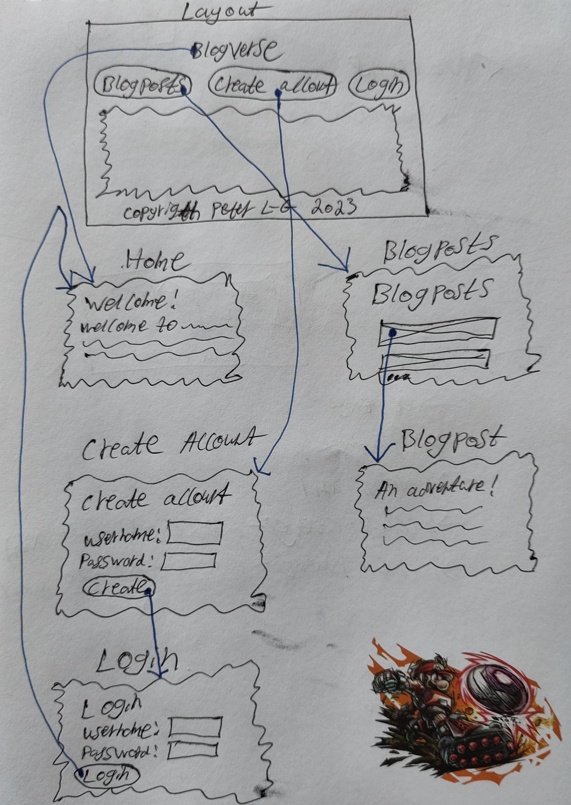

# Project Work
On this page you find information about the examination test `Project work`.


## General information
<CompactInfo :infoPieces='{
    "Number of credits": "4",
    "Grades": ["Fail", "3", "4", "5"],
    "How to work": "In pairs",
    "Goal": "To learn how to implement a platform using a Single-Page Application framework, a backend framework exposing a REST API, a database to store the data on the platform, and how to use Docker to run all of these",
    "Instructions": `Complete the different parts the project work consists of described on this page. You will implement a platform, write a report describing your implementation and present your platform to the "rest" of the class (in smaller groups) at the end of the course`,
    "Grading guidelines": "Available on the Project Grading Guidelines page",
    "Re-examination": "A special presentation session will be available at each re-exam periods in June and in August (contact the course coordinator for more details). Your work can also be graded at these re-exam period, but it will only be graded Fail/3",
    "Help": "Come to the lab sessions and ask the teacher there for help"
}'>
</CompactInfo>


## Introduction
As project work you should work in pairs to create a platform per the instructions on this page. The platform will consist of:

* A relational database that stores the resources created on the platform
* A web application that exposes a REST API clients (i.e. other applications) can use to access the data on the platform (known as the *backend*)
* A Single-Page Application with a graphical user interface (GUI) users can use to use to work with the data on the platform (known as the *frontend*)

You have a lot of freedom when it comes to the design and functionality of the platform, but the following requirements exist:

* There should exist at least three different type of resources on the platform:
    * One of the resource types must represent *accounts* users can create and login to
    * The other two resource types must somehow have a relation to accounts (direct or indirect)
* All three type of resources need to support all four Create, Retrieve, Update and Delete (CRUD) operations

Use whichever type of resources you want in addition to accounts. Some general examples are:

* *Threads* logged in users can create and that other logged in users can write *posts* in
* *Blogposts* logged in users can create and that other logged in users can write *comments* on
* *Todo lists* logged in users can create and then add *todo items* to

There already exists many websites with the resource types mentioned above, and creating a smaller copy of one of them is OK, but usually not that fun. Instead, try to come up with a more specific problem you can solve. Some examples are:

* For a *Car Insurance Company*:
	* *Insurance Plans* (price, info about what's included in the plan, which admin account that is responsible for the plan, etc.)
	* *Subscriptions* (which account that subscribed, which plan to subscribe to, car registration number, etc.)
* For a *Rescue Service*:
	* *Accidents* that has happened (place, time, type of accident, which admin account that is responsible for taking care of the accident, etc.)
	* *Work Hours* reported by the personnel (which account, which accident, how many work hours, etc.)
* For a *Football Club*:
	* *Teams* in the club (boys/girls, age of players, who the coach is (responsible admin account), etc.)
	* *Players* in each team (which account, which team, which number the player has, which position the player has, etc.)

::: tip Finding a good problem to solve
Most good problems that are obvious to programmers have already been solved by other programmers. To find a good problem to solve as project in this course, you usually need to explore domains you are unfamiliar with. Ask your friends and family if they have a need of a platform of some kind. Someone working within elderly care might have a problem you can solve with a platform you can implement in this course? Without you asking someone who works within elderly care about what problems they have, you will never now. Or ask someone who likes to walk in the nature? Or maybe ask someone helping homeless people? Etc.
:::

Implement the platform per the instructions on this page. In addition to implementing the platform, you should also write a report describing how the platform works and how it has been implemented. The file [project-report-template.docx](files/project-report-template.docx) contains a template with further instructions on this. **Your report will be a living document throughout the course, meaning that you will start writing on it in the beginning of the course, and then continuously improve and add content to it throughout the course.**

Since the project is carried out in pairs, you also need to some degree document who has done what in the project, so the examiner can verify that you both have contributed approximately equally much. If you use a version control system properly (i.e. you have good descriptive commit messages, each commit implements a single new feature on the platform, etc.), then you can simply use your commit history as documentation for who has done what. Otherwise you need to keep track of and present this in some other way. See the *Worklog* chapter in the report template for more information.

On the [Project Grading Guidelines](./project-grading-guidelines/) page you find some guidelines for how your project will be graded. You are recommended to read through it every now and then.

To help you, we have divided the project work into smaller parts that we recommend you to complete in order. The rest of this page contains descriptions of these smaller parts. Before you start working on the first part you are recommended to read through all the parts, which will give you a good overview of the work that lies ahead.

Good luck!


## Installing required software
**If you work on the computers in E2205, E2432 or E2433**, all required software should already be installed for you, so you should not need to install anything yourself.

**If you work on a school computer in any other room**, you need to manually install the required software through the *Software Center* application (unless someone else has already done that on the specific computer you use).

**If you work on your own private computer**, you need to download and install all required software yourself. In this course, we use only free software available for both Windows, Mac and Linux.

The required software is:
* [Docker](https://docs.docker.com/get-docker/) \
    A program used for containerization, i.e. a program used for running other programs in an isolated and configurable environment

::: danger Docker Toolbox for Windows
There existed an old version of Docker for Windows called *Docker Toolbox*. It shouldn't be used anymore, so Windows users, be sure to use *Docker Desktop for Windows*. 
:::

::: warning About Docker Desktop for Windows
Docker Desktop for Windows can be used with either *Windows Subsystems for Linux 2* (WSL2) or Hyper-v. If you have Windows 10 Home (as most users), you must use it with WSL2. For more details, see the installation instructions on Docker's website.
:::

* [Node.js](https://nodejs.org/en/) \
    Use whichever version you want, but most likely the newer the better. If you don't want to gamble, go with the latest LTS version
* [npm](https://www.npmjs.com/) \
    This one is installed along with Node.js, so you do not need to install it separately. However, you might want to [update npm to the latest version](https://docs.npmjs.com/troubleshooting/try-the-latest-stable-version-of-npm)
* [Postman](https://www.postman.com/) \
    An application one can use to send custom HTTP requests

The following software tools are not required, but recommended:

* [Visual Studio Code](https://code.visualstudio.com/) \
    IDE with good support for writing, running and debugging Node.js and JavaScript code, but feel free to use whichever IDE you want
* [Git](https://git-scm.com/) \
    Version Control System that makes it very convenient to work on the project from different computers


## Part 1: Project group
The project work should be carried out in pairs. Let the examiner know who you are working with by joining one of the [Project Groups](https://ju.instructure.com/courses/6820/groups) on Canvas.

If you can't find someone to work with, send the course coordinator an email at [Peter.Larsson-Green@ju.se](mailto:Peter.Larsson-Green@ju.se) using the template in <FigureNumber /> below (you just need to replace `XXX` with your own specific values).

<Figure caption="Template of message to be sent to the course coordinator if you can't find a partner to work with on your own.">

```
Hi!

I need you to match me with a student for the project work.

Course: Web Development - Advanced Concepts
My name: XXX
My JU email: XXX@student.ju.se
The grade I'm aiming for in this course: XXX
I got the following grades in the following pre-requisite courses:
 - Introduction to Programming: XXX
 - Data Structures and Algorithms: XXX
 - Object-Oriented Programming: XXX
 - Network Programming: XXX
 - Web Development Fundamentals: XXX

Thanks!
```

</Figure>

If you don't care about who you are matched with, you just need to enter your name and JU email in the template. The course coordinator will then try to match you with a student with similar ambitions and skills as you.


## Part 2: Project environment
Before you start working on this part, you are recommended to:

* Read/View the following lectures:
    * [Teamwork](../../lectures/teamwork/)
* Read the following short course on Git:
    * [Git](../git/)

---

The very first thing you and your partner should agree on is how you should work together with your partner. Especially, you need to some extent document who is doing what in the project, and write that in your report, so the examiner can verify that all group members have contributed approximately equally much.

We recommend you to work together per the basis described in the [Teamwork](../../lectures/teamwork/) lecture. That way you will automatically document who has contributed with what by using Git and GitHub issues. But if you want to work together in another way, that is OK too as long as you can show who has contributed with what in the project. The *Worklog* chapter in [project-report-template.docx](files/project-report-template.docx) shows an example of how you can report who has contributed with what in the project.

If you agree on using a version control system, try to use it for as much as possible. For example, you can also put your report in your repository, and not only your source code. If you agree on using a version control system, create the remote repository for it now, for example using [GitHub](https://github.com/), and then clone it to your own computers


## Part 3: Platform idea
Before you start working on this part, you are recommended to:

* Read/View the following lectures:
    * [Report Writing](../../lectures/report-writing/)
    * [UML Use-Case Diagrams](../../lectures/uml-use-case-diagrams/)

---

Your first task is to come up with what the platform you will create should be about. Try to be creative and create a platform that solves a real-world problem ordinary people are having. Feel free to ask your family and friends for problems they have that can be solved using a platform. Examples of real-world problems could be:

* I often forget meetings
* I often make bets with my friends, they remember the bets I lose so I have to pay them, but I often forget the bets I win, so they never pay me
* I like to keep track of which celebrities I've seen, but I rarely remember that
* I often eat lunch alone, and that's so boring
* I need to find someone I can play padel with

The only important thing is that your platform can be implemented using at least 3 type of resources (accounts user can login + at least two more resource types connected to accounts + all four CRUD operations on all three resource types), but the more useful your platform can be, the more fun it will be to implement it. Optimally, you have such a great idea that you will want to launch your platform online after the course.

Your platform should be described in the project report, so in this part of the project, you will not do any programming, but only work on your report. You should be able to complete at least the *Introduction* chapter.

::: tip Role-playing!
Usually, the *customer* has the problem, and she will come to you and explain the problem to you. Then you, as the *developer*, will come up with and suggest the solution (an app) to the customer. To make sure that both of you have the same understanding of what functionality the solution should contain, you should visualize the functionalities in a use-case diagram in your report.

In the project in this course, most of you will most likely not have a customer with a problem, but you have instead come up with a problem on your own that you try to solve. In that case you must do role-playing:

1. Pretend you are the customer, and specify the problem you have
2. Change role and become the developer, and suggest a solution (the platform) to the problem
3. As the developer, draw a use-case diagram showing what functionality you think the application should contain
4. Switch role to the customer, and either accept the suggested functionality in the use-case diagram, or explain to the developer what functionality you are missing, and then as the developer add the missing functionality
:::

When you are done describing your platform idea in the report, discuss it with a teacher at one of the lab sessions or some friends to get some initial feedback on your idea, and then improve it.


## Part 4: Graphical user interface
Before implementing an application, it is crucial to first specify how the application should work. This is especially true when you are multiple developers working on the same application; without a specification to lean on, all in the group will have their own idea of how the application should work in the end.

A good way to quickly visualize how the application should work in the end is by drawing a wireflow showing how the user can navigate between the different pages the application consists of, and to some degree show what the user can do on each page, as shown in <FigureNumber /> below.

<Figure caption="Example of parts of a wireflow showing the graphical user interface of an application with accounts and blogposts.">



</Figure>

By drawing a wireflow, all in the group can look at it and get the same understanding of how the application should work in the end. Further more, and more importantly, the customer can also look at the wireflow and then confirm that the application you intend to build really works the way the customer wants it to work, or suggest how it should change. In projects, it is all too common that the customer is not involved in the project from the start, and the developers then end up building an application that doesn't work the way the customer wants it to work, so they deliver an application no on wants to use. That's a big waste and must be avoided by including the customer in the development process!

Finish the Graphical User Interface chapter in the report. You can draw the wireflow using pen and paper, and then take a picture of it with a camera, and then add the picture to the report to show what you intend the graphical user interface to look like. If you want to draw the wireflow using a software tool instead, that is of course OK too.

::: tip Use an HTML and CSS framework if you want!
Later, you will implement the GUI in HTML and CSS. If you want, you can write all the HTML and CSS code for the GUI yourself, but to avoid spending too much time on that, we recommend you to use an HTML and CSS framework that contains pre-made GUI components you can use. That way, you need to write much less code, and can instead spend more time on the other parts of the project.

If you want to use an HTML and CSS framework, we recommend you to choose which one you want to use now, so you can design your GUI based on the GUI components that are available in the HTML and CSS framework you use.

Since you later will implement the GUI in a Single-Page Application that requires client-side JavaScript to be enabled to work, there is no problem with using an HTML and CSS framework that also makes use of client-side JavaScript, so feel free to use that if you want.
:::

When you are done, show the current version of your report to a teacher at a lab session to get some feedback on your work.


## Part 5: Frontend GUI
Before you start working on this part, you are recommended to:

* Read/View the following lectures:
    * [Svelte](../../lectures/svelte/) (use another frontend framework if you want)
    * [ Content Delivery Networks](../../lectures/content-delivery-networks/)

---

In the end, your solution will consist of multiple components:

1. A database that stores the data on the platform
2. A backend application (the web application) that gives other applications access to the data in the database through a REST API
3. A frontend application (the Single-Page Application) users can use to work with the data through a GUI, and that access the data through the REST API

What feels most natural is to implement the components in the order mentioned in the list above. After all:

* The backend is dependent on the database, and can't function without it
* The frontend is dependent on the backend, and can't function without it

However, that way of implementing the solution have often turned out to be bad, because very often when the solution has been implemented and the customer can test it, the customer realizes that she wants some things to work in another way, and changing that after it has been implemented is very expensive (time consuming).

So, instead, one usually starts by building a prototype of the frontend application (an application that will look the way it's supposed to look in the end, but whose functionality mostly don't work), which the customer then can test and evaluate, and if the customer wants to change something in it, that can easily be done without taking too much time, since it's only a simple prototype. Then, when the customer is happy with how the prototype works, the entire solution can be implemented.

A prototype application can be implemented using a software tool designed to quickly create a prototype application, but in this course you will instead implement the prototype application directly as the Single-Page Application that will be used in the end, but instead of storing the data in a database and access it through the backend's REST API, you will hardcode the data directly in the Single-Page Application.

When you're done with that, the customer can test the prototype, and if the customer is happy with how it works, you can continue by implementing the database and the backend, and then change the frontend to access the data through the REST API instead of hardcoding it in the frontend.

In this course, you will use a frontend framework to implement your Single-Page Application in. There exists many of them, such as:

* [Angular](https://angular.io/)
* [React](https://reactjs.org/)
* [Vue](https://vuejs.org/)
* [Svelte](https://svelte.dev/)

Use whichever frontend framework you want, but in this course we will teach you and recommend you to use Svelte. Svelte is not used much in the industry yet, but in our opinion it's the easiest framework to learn and get started with. If you use another framework, we also can't guarantee that you can get help from a teacher at the lab sessions, since not all teachers know all of these frameworks, so only use another framework in you feel confident that you can learn and use it on your own.

### Getting started
In this subchapter we provide some instructions helping you to get started with using Svelte. If you choose to use another frontend framework, read the documentation for that framework to learn how to use it.

1. If you use a version control system, open your local repository folder in a shell. If you don't use a version control system, simply create a new folder for your project on your computer, and open that in a shell
2. In the shell, run the command `npm create vite@latest`, and choose the following options:
	* `Project name`: `frontend`
	* `Select a framework`: `Svelte`
	* `Select a variant`: `JavaScript`
3. Run the following commands in the shell:
	1. `code .`
	2. `cd frontend`
	3. `npm install`
	4. `npm run dev`
4. Open [127.0.0.1:5173](http://127.0.0.1:5173/) (or whichever port number you end up using) in a web browser to run the frontend application
5. As you make changes to the code and save them in Visual Studio Code, Vite will push the new version of the code to the wb browser, which shows the new version instantly. Try it out!

Implement the layout of your frontend application in the `App.svelte` file. The main content on the different pages can be implemented in their own `.svelte` files. To connect each page to its own URL, you can use the npm package [svelte-routing](https://github.com/EmilTholin/svelte-routing). 

Create a file called `data.js`, in which you hardcode and export some data that is available on your platform, for example (if your platform is about blogposts and comments):

```js
export const accounts = [
	{id: 1, "name": "Alice"},
	{id: 2, "name": "Bob"},
	{id: 3, "name": "Claire"},
]

export const blogposts = [
	{id: 1, authorId: 1, "title": "Alice's adventure Part 1"},
	{id: 2, authorId: 2, "title": "My birthday!"},
	{id: 3, authorId: 1, "title": "Alice's adventure Part 2"},
]

export const comments = [
	{id: 1, blogpostId: 1, commenterId: 2, content: "Exciting, can't wait for Part 2!"},
	{id: 2, blogpostId: 2, commenterId: 1, content: "Happy birthday Bob!"},
	{id: 3, blogpostId: 2, commenterId: 3, content: "🎉🎂"},
]
```

Try to structure your data the same way you would structure it in a relational database, and you will need to make less changes to the code later when you start using the database and the backend application. So, explaining how you structure your data in the *Database* chapter in your report now is a good idea.

In the `.svelte` component for the different pages, import the data from the `data.js` file the page should show, and then show that data in that component. The `<form>` elements you have on the different pages don't need to do anything now; this part of the project is just about showing the GUI, so the customer can try out the navigation by clicking on different links in the application.

When you're done, if you have a customer, then show the prototype to the customer, and ask for feedback. I you don't have a customer, you can show your prototype to a teacher at a lab session or some of your friends, and ask what they think about your GUI. Also, don't forget explain how you have implemented the frontend in your report.


## Part 6: REST API
Before you start working on this part you are expected to read/view the following lectures:

* [REST API Basics](../../lectures/rest-api-basics/)

---

Design the REST API you will implement on the backend application and through which the frontend application will communicate with it. By looking at the graphical user interface in your report you should be able to figure out which requests the frontend needs to be able to send to the backend to be able to function properly. For example, if the frontend  have a "page" showing a list of all accounts, then your REST API should send back all accounts when it receives a `GET` request for `/accounts` (or similar), and if the frontend has a "page" showing all information about an account with a specific id, then your REST API should send back all information about an account with a `SPECIFIC_ID` when it receives a `GET` request for `/accounts/SPECIFIC_ID` (or similar; replace `SPECIFIC_ID` with an actual id).

::: warning Note
You do not need to worry about login functionality (authentication and authorization) yet, that comes in Part 10. For now, it's OK if any user can carry out any operation.
:::

Describe the REST API in your project report. Be as detailed as possible; other programmers should understand how to use your REST API just by reading the specification for it in your report. This means that you must mention details such as which methods, URI:s, status codes (all of them, including the ones used when the request is not carried out), headers etc. that are used in your REST API for each request it supports.

An example of a good REST API specification is [Stripe's REST API specification](https://stripe.com/docs/api/accounts). Feel free to take inspiration from that.

When you are done, show your REST API specification to a teacher at a lab session to get some feedback on it.


## Part 7: Database
Before you start working on this part, you are recommended to:

* Read/View the following lectures:
    * [Docker Basics](../../lectures/docker-basics/)
    * [Scaling Databases](../../lectures/scaling-databases/)

---

In this part, the goal is to use Docker and Docker Compose to get your database up and running in a container you can connect to from your own computer, as shown in <FigureNumber /> below.

<Figure caption="Architecture on Windows/Mac.">
<RenderMermaid graph-definition="
flowchart
	db[DB]
	dbClient[DB Client]
	subgraph Your Computer
		subgraph Your OS
			dbClient
		end
		subgraph Linux
			subgraph Container 1
				db
			end
		end
	end
	dbClient--SQL-->db
" />
</Figure>

::: warning For Linux users
If you use Linux as the operating system on your computer, then you will only have one Linux installation on your computer, as shown in <FigureNumber /> below instead.

<Figure caption="Architecture on Linux.">
<RenderMermaid graph-definition="
flowchart LR
	db[DB]
	dbClient[DB Client]
	subgraph Your Computer
		subgraph Linux
			dbClient
			subgraph Container 1
				db
			end
		end
	end
	dbClient--SQL-->db
" />
</Figure>

:::

### Creating Docker image
In your project folder, create a new folder that will store the code required to run all the applications your solution consists of (database, backend and frontend). We will refer to this folder as the `applications` folder.

::: tip Docker on Windows
When using Docker on Windows, the recommendation is to use Windows Subsystem for Linux 2, and place your project folder on the file system for the Linux distribution you are using. If you work on your private computer (i.e. uses Window 10 Home), do that, as shown in <FigureNumber /> below. Otherwise automatic restart of applications when you save code changes made to files might not work (learn more about that later).

<Figure caption="Architecture on Windows 10 Home.">
<RenderMermaid graph-definition="
flowchart
	db[DB]
	dbClient[DB Client]
	pf[Project Folder]
	subgraph Your Computer
		subgraph Windows 10 Home
			dbClient
		end
		subgraph Linux
			subgraph Container 1
				db
			end
			pf
		end
	end
	dbClient--SQL-->db
" />
</Figure>

On the school's computers (that uses Windows 10 Education), Docker runs on Hyper-V instead of Windows Subsystem for Linux 2, so on the school's computers you should place your project folder directly on the file system on Windows instead, as shown in <FigureNumber /> below.

<Figure caption="Architecture on Windows using Hyper-V (the school's computers).">
<RenderMermaid graph-definition="
flowchart
	db[DB]
	dbClient[DB Client]
	pf[Project Folder]
	subgraph School Computer
		subgraph Windows 10 Education
			dbClient
			pf
		end
		subgraph Linux
			subgraph Container 1
				db
			end
		end
	end
	dbClient--SQL-->db
" />
</Figure>

For detailed information, read [Docker Best Practices](https://docs.docker.com/desktop/windows/wsl/#best-practices).

The rest of the instructions on this page assumes the project folder has been placed on the file system for the Linux distribution you are running. Mac users will simply place the projects folder on the file system for Mac.
:::

In the `applications` folder, create a folder that will store all the code required to run the database. We will refer to this folder as the `database` folder.

In the `database` folder, create a new file named `Dockerfile` that specifies which database to run. Use whichever type of *relational database* you want (MariaDB, MySQL, MariaDB, etc.). On [Docker Hub](https://hub.docker.com/), find an image that contains the database you want to use, and then inherit from that one in your own `Dockerfile` using the [FROM](https://docs.docker.com/engine/reference/builder/#from) instruction.

Read the documentation for the image on Docker Hub you inherit from to learn how to use it. For example, many images for relational databases there come with a default username you can use to connect to it, and you can learn which that is, and how to change it, from the documentation.

To test your database, you first need to tell Docker to build an image based on the instructions in your `Dockerfile`. To do that, go to your `database` folder (that contains the `Dockerfile`) in a shell, and then run the following command:

```
docker build --tag=db .
```

That command creates a new Docker image named `db` that is based on the instructions you wrote in the `Dockerfile`, and that only exists on your computer.

### Running Docker image
To run your `db` image in a new container, run the following command:

```
docker run db
```

However, when running that command, you might need to pass along environment variables that configures the database, such as an environment variable that specifies which the password for the root user on the database should be, or the name of a database that is automatically created when the relational database starts. For example, if you use MariaDB, you would need to run the following command:

```
docker run -e MARIADB_ROOT_PASSWORD=abc123 db
```

That command would start the database with the root user's password set to `abc123`. In a similar way, one can often also pass along an environment variable that specifies the name of a database that should be created in the relational database you are using when it starts (see the documentation for the database image you are inheriting from).

Try to get your database up an running (when running the command in the shell, nothing should crash). Often, you can stop the container from running by pressing `[CTRL]` + `[C]` (pressing it twice might be needed), or you can stop it from the Docker Desktop application that is running.

### Connecting from the host computer
By default, a container runs in an isolated environment. So even if you get your database up and running in the container, you can't connect to it from outside the container, so you can't connect to it from your own computer. To be allowed to connect to it from your own computer, you need to use [Docker port mapping](https://docs.docker.com/config/containers/container-networking/#published-ports), as shown in <FigureNumber /> below.

<Figure caption="Port mapping.">
<RenderMermaid graph-definition="
flowchart
	db[DB Container]
	dbClient[DB Client]
	pf[Project Folder]
	subgraph Your Computer
		subgraph Your OS
			dbClient
		end
		subgraph Linux
			pf
			subgraph Container 1
				db
			end
		end
	end
	dbClient--Port 5555 : Port 3306-->db
" />
</Figure>

For example, MariaDB accepts connections on port `3306`, and to be allowed to connect to that port in your container from your own computer, you need to map a port on your own computer (use whichever you want that is available on your computer) to port `3306` in the container. You can for example (most likely) map it to the port `5555` on your computer by starting it with the following command:

```
docker run -p 5555:3306 -e MARIADB_ROOT_PASSWORD=abc123 db
```

::: warning Be consistent
It's probably a god idea to map port `3306` on your own computer to port `3306` in the container. Then it's only one port number you need to remember. Here we use different port numbers to show the difference.
:::

After that, you should be able to connect to the database from your own computer. To do that, you need a database client that can connect to the type of database you are using. Visual Studio Code does most likely have an extension you can install and use for that (search for that yourself in the *Extensions* panel in Visual Studio Code), but there also exist many  desktop applications one can install and use (search for that yourself on the web). Use whichever you prefer. Read in the documentation for the database image you inherit from on Docker Hub to learn the connection details (username, password, port, database name, etc.).

After you have connected to the database in the container from your own computer, try sending a query to it to verify that the connection works (for example, a query that creates a new table in the database) from your database client.

### Using Docker Compose
Starting the database using a very long command like the following:

```
docker run -p 5555:3306 -e MARIADB_ROOT_PASSWORD=abc123 db
```

is not that convenient. Especially not when we later also will need to start our backend application and frontend application with similar commands. Instead of doing that, we can use Docker Compose to start all of those containers using a single command.

To use Docker Compose, you first need to create the `compose.yaml` file in the `applications` folder. In it, you can specify which images to start, which environment variables to pass to them, how ports should be mapped, etc. To start running our own database image in a new container with the environment variable and port mapping we had before, we could put the following content in the `compose.yaml` file:

```yaml
services:
	db:
		build: ./database/
		ports:
			- "5555:3306"
		environment:
			MARIADB_ROOT_PASSWORD: abc123
```

After that, you can go to your `applications` folder in a shell and run the following command:

```
docker compose up
```

to run the images specified in the `compose.yaml` file in new containers (currently only the `db` image). Press `[CTRL]` + `[C]` (possibly twice) to stop the started containers from running.

::: warning Rebuilding images
By default, the command `docker compose up` will not rebuild your images, not even when you have made changes to the `Dockerfile`. Usually, we want it to be rebuild the images when we have made changes to them, so usually we add the `--build` flag to the command, so we instead run the command:

```
docker compose up --build
```
:::

### Initializing the database
When our database starts running in a new Docker container, we usually also want to create the tables it should contain. Most database images you find on the Docker Hub has way of running some SQL code when the database starts for the first time. For example, for the MariaDB database image, any SQL code you write in an `.sql` file you put in the folder `/docker-entrypoint-initdb.d/` in the image will be executed the first time the database starts.

In the `database` folder in your project, you can create a file named, for example, `create-tables.sql`, and then in the `Dockerfile` add the following instruction:

```
COPY ./create-tables.sql /docker-entrypoint-initdb.d/
```

Then the SQL code you write in the `create-tables.sql` file will be executed when the database starts, so there you can put your `CREATE TABLE` queries.

::: danger An anonymous volume might be used!
A container does by default only have access to the files and folders in the container itself. By using a volume, you can grant a container access to a folder on the host computer. That way, the application running in the container can store files on the host computer that will continue to exist even after the container has been deleted.

Some database images automatically use such a volume to store information about the database (which tables that are in it, what data they contain, etc.). Each time you start the database image in a new container, a new anonymous volume is created for that container, so the database in the container can store its data there, and that volume continues to exist even after the database container stops running and is deleted.

When using Docker Compose, the first time you run the command `docker compose up` it will create a new container your database will run in, and give it access to a new volume. However, Docker Compose will continue to use the same volume the next time you run `docker compose up`, even if you use `docker compose up --build` and rebuilds the image. And, the way many of these database images work is that they will only run the SQL code in the `.sql` files in the `/docker-entrypoint-initdb.d/` folder if the volume is empty. So the database will not pickup the changes you have made to the SQL code the next time you run the command `docker compose up --build`.

When we use Docker Compose, this is usually **not** the behavior we want, but we instead want the database to get a new volume, so the queries in the `.sql` files in the `/docker-entrypoint-initdb.d/` folder are executed each time we use the `docker compose up` command and have made a change to the database image. To make that happen, we also need to use the `--renew-anon-volumes` flag:

```
docker compose up --build --renew-anon-volumes
```

For more information about this annoying behavior, see the GitHub issue [Why is there volume for data in the first place?](https://github.com/docker-library/mysql/issues/255).

Another solution is to run the following command before you run the `docker compose up` command:

```
docker compose down
```
:::

It can also be a good idea to, in a similar way, create an `insert-data.sql` file that populates the tables with some initial data when the database starts (used during development; does not make sense to do when the platform runs for real).

When you are done with this part of the project, you should be able to finish the Database chapter in the report.


## Part 8: Backend
Before you start working on this part, you are recommended to:

* Read/View the following lectures:
    * [REST API in Express](../../lectures/rest-api-in-express/)
    * [Asynchronous Programming in JavaScript](../../lectures/asynchronous-programming-in-js/)
    * [Handling Concurrent HTTP Requests](../../lectures/handling-concurrent-http-requests/)
    * [Scaling Web Applications](../../lectures/scaling-web-applications/)

---

In this part, the goal is to use Docker and Docker Compose to get your backend up and running in a container, and to connect it to the database, as shown in <FigureNumber /> below.

<Figure caption="Architecture.">
<RenderMermaid graph-definition="
flowchart
	db[DB]
	backend[Backend]
	pm[Postman]
	pf[Project Folder]
	subgraph Your Computer
		subgraph Your OS
			pm
		end
		subgraph Linux
			subgraph Container 2
				backend
			end
			subgraph Container 1
				db
			end
			pf
		end
	end
	pm--HTTP-->backend
	backend--SQL-->db
" />
</Figure>

But to get a gentler start, we will first get the backend running on the computer without Docker, as shown in <FigureNumber /> below.

<Figure caption="Architecture.">
<RenderMermaid graph-definition="
flowchart
	db[DB]
	backend[Backend]
	pm[Postman]
	pf[Project Folder]
	subgraph Your Computer
		subgraph Your OS
			pm
			backend
		end
		subgraph Linux
			subgraph Container 1
				db
			end
		pf
		end
	end
	pm--HTTP-->backend
	backend--SQL-->db
" />
</Figure>

### A basic implementation
Create a new folder where you can store the source code for your backend application. To start with, you can store it on the file system for your ordinary operating system. We will refer to this folder as the `backend` folder.

Open the `backend` folder in a shell, and then run the following commands (you don't have to use Express, but if you use another framework, the teacher at the lab sessions might not be able to help you):

1. `npm init --yes`
2. `npm install express`
3. `npm install A_DATABASE_CLIENT_PACKAGE` (find one in the [npm Registry](https://www.npmjs.com/) you can use for the type of database you are using (preferably a package using promises instead of callback functions))
4. `mkdir src`

It is in the `src` (short for *source*) folder you should put your own source files. The reason we use a special folder for this is because we later, when using Docker, want to mount the folder to the container running the backend application as a volume (learn more about this later).

Put a file called `app.js` (or whatever you prefer) in the `src` folder with the content looking something like what's shown below:

```js
const express = require('express')
const DatabaseClient = require('A_DATABASE_CLIENT_PACKAGE') // Change to your db client

// See the documentation for the db client package you are using
// to learn how to use it, but it will be something like this:
const db = new DatabaseClient({
	username: "root",   // See the documentation for the database you are
	password: "abc123", // using to learn which connection settings you
	host: "localhost",  // should use, but it usually includes these 5
	port: 5555,         // options.
	database: "my-db",
})

const app = express()

app.get('/accounts', async function(request, response){
	
	// See the documentation for the db client package you are using
	// to learn how to use it, but it will most likely be something
	// like this:
	
	try{
		
		const query = `SELECT * FROM accounts`
		
		const accounts = await db.query(query)
		
		response.status(200).json(accounts)
		
	}catch(error){
		
		console.log(error)
		response.status(500).end()
		
	}
	
})

app.listen(8080)
```

::: tip Using ECMAScript modules instead of CommonJS
Those who want to try to use ECMAScript modules instead of CommonJS are free to do so. Then you need to either:

* Name your JavaScript files with the `.mjs` extension instead of `.js`, or
* In your `package.json`, add the `"type"` property, and give it the value `"module"`
:::

Open the `backend` folder in a shell, and then run the following command to start your backend application:

```
node src/app.js
```

Use Postman to send a GET request to `localhost:8080/accounts`, and verify that you get back all the accounts stored in the database (the database image must be running in container for this to work, and you must have created a table named `accounts` in it). If you haven't inserted any entries to the `accounts` table yet, you should get back an empty JSON array.

### Building and running a Docker image
Great, now you have a basic backend application that can communicate with the database. Let's try to run it in a container instead.

Move the `backend` folder to the `applications` folder. Then, in the `backend` folder, create the `Dockerfile`, and inherit from an image on Docker Hub that contains the things you need to run your code. To learn which instructions you need to write in the `Dockerfile`, read the webpage [Dockerizing a Node.js web app](https://nodejs.org/en/docs/guides/nodejs-docker-webapp/). You simply need to write instructions that:

1. Specify which image to inherit from
2. Specify which the working directory should be in the image
3. Copy over the `package.json` file
4. Copy over the `package-lock.json` file
5. Run the command `npm install`
6. Copy over the `src` folder
7. Tell the image that `node src/app.js` is the command that should be executed to start the application in the image

Instead of using `docker build` and `docker run` to test if it works, let's directly continue with using Docker Compose, and test it that way.

### Using Docker Compose
Change the `compose.yaml` file in the `applications` folder to also build and run the backend.

When the backend and the database is started using Docker Compose, they will be put in containers that belongs to the same *virtual network*, and they can connect to each other directly, without using port mapping. Each container will get its own domain name based on the name of the service you have used in the `compose.yaml` file. For example, if you used:

```yaml
services:
	db:
		# And the rest...
```

Then the backend can use `db` as the `host` connection parameter to the database to indicate that it should connect to the database container. To be able to connect to the backend from your web browser you still need to use port mapping, for example map port `3000` on your computer to port `8080` in the backend container, as shown in <FigureNumber /> below, since the computer running your OS is not part of the virtual network.

<Figure caption="Architecture.">
<RenderMermaid graph-definition="
flowchart
	db[DB Container]
	backend[Backend]
	pm[Postman]
	subgraph Your Computer
		subgraph Your OS
			pm
		end
		subgraph Linux
			subgraph Container 2
				backend
			end
			subgraph Container 1
				db
			end
		end
	end
	pm--Port 3000 : Port 8080-->backend
	backend--db-->db
" />
</Figure>

You should then be able to start the database and the backend at the same time in Docker by simply running the following command in a shell in the `applications` folder:

```
docker compose up --build --renew-anon-volumes
```

::: warning The database takes time to start!
Most often, the backend will start running before the database (the database takes longer time to start). If the backend tries to connect to the database when the backend starts, that will most likely fail, because the database is not up and running yet, so the backend can't connect to it at that point in time.

Some npm database client packages tries to connect to the database as soon as the client is created, and they will crash your application if they fail to do so. If that's the case, you need to find a workaround of some kind, for example:

* Use a connection pool instead of establishing just a single connection (a good idea even if you don't have this problem). Read the documentation for the npm package you use to learn if it supports connection pooling or not
* Use another npm package to communicate with your database
* Ask a teacher for help at one of the lab sessions
:::

### Using a volume
The way it works now is that each time you have made changes to the JavaScript code in your backend and want to run the backend with those changes, you need to stop Docker Compose from running, and then run the command `docker compose up ...` again to build a new image for you backend and start it in a new container. That's not a very convenient way of working.

To resolve this, we can instead use a volume. The idea is that we will mount the `src/` folder as a volume to the container running the backend, and whenever the backend tries to access a file in the `src/` folder, it will read it from the `src/` folder on your operating system, instead of the `src/` folder in the container. That way, the backend can always read the latest version of your JS code through the volume!

To make that happen, change the `backend` service (or whatever you have called it) in your `compose.yaml` file to also make use of a volume:

```yaml
services:
	backend:
		build: ./backend
		volumes:
		 - "./backend/src/:/path/to/the/src/folder/in/the/image/"
# And all the other stuff...
```

The syntax for specifying a volume is `./path/to/a/folder/on/host/the/computer/relative/the/compose.yaml-file/`:`/path/to/a/folder/in/the/image/`. Whenever an application in the container tries to access something in the folder `/path/to/a/folder/in/the/image/`, Docker will instead give it access to the folder `./path/to/a/folder/on/the/host/computer/relative/the/compose.yaml-file/` on your computer instead.

For more information on writing paths for volumes, see [Compose file version 3 reference --> Volumes --> Short syntax](https://docs.docker.com/compose/compose-file/compose-file-v3/#short-syntax-3).

However, each time you have made a change to a JavaScript file in the `src/` folder, Node.js in the container needs to restart your application to pick up the changes. To make that happen, we can use the [Watch mode](https://nodejs.org/en/blog/release/v18.11.0/) feature that was added to Node.js in version `18.11.0`. In your `Dockerfile`, add the `--watch` flag to the command used to start your backend application (i.e. use `node src/app.js --watch`).

::: warning Older versions of Node.js
If you use an older version of Node.js that doesn't support the Watch mode, you can use the npm package [nodemon](https://www.npmjs.com/package/nodemon) to get the same functionality. But better to use Watch mode these days.
:::

::: danger Windows file system events not propagated to Linux containers!
The way Watch mode and nodemon work is that they rely on the operating system to notify them when a file has changed. On Windows, these events are not forwarded to the Linux containers if:

* You use Windows 10 Home with Windows Subsystem for Linux, and
* Have placed your project folder on the file system for Windows

So, make sure that you have placed your project folder as we described in Part 7: Database. Then file system events should be propagated correctly.
:::

After you have started your container, try adding `console.log("Hello")` in the beginning of your `app.js` file, and in the shell verify that your backend has automatically restarted and logged the text `Hello`.

### Implementing
In the backend, implement all operations your REST API needs to support per the specification you wrote in your report. Use Postman (or whichever application you prefer) to test that it has been implemented correct. You don't need to worry about authentication and authorization yet, that comes in a later part.

When you are done, update your report to describe how the backend has been implemented. Feel free to show your report to a teacher at one of the lab sessions to get some feedback on it.


## Part 9: Frontend-Backend
Before you start working on this part, you are recommended to:

* Read/View the following lectures:
    * [Same-Origin Policy and Cross-Origin Resource Sharing](../../lectures/sop-and-cors/)
    * [AJAX](../../lectures/ajax/)

---

In this part, the goal is to use Docker and Docker Compose to get your frontend up and running in a container, and then allow the Web Browser to retrieve your SPA from it, and then allow the SPA in the Web Browser to connect to the backend, as shown in <FigureNumber /> below.

<Figure caption="Architecture.">
<RenderMermaid graph-definition="
flowchart LR
	wb[Web Browser]
	db[DB]
	backend[Backend]
	frontend[Frontend]
	pf[Project Folder]
	subgraph Your Computer
		subgraph Your OS
			wb
		end
		subgraph Linux
			subgraph Container 3
				frontend
			end
			subgraph Container 2
				backend
			end
			subgraph Container 1
				db
			end
			pf
		end
	end
	wb--HTTP get SPA-->frontend
	wb--HTTP from SPA-->backend
	backend--SQL-->db
" />
</Figure>

### Building and running a Docker image
Place your `frontend` folder in your `applications` folder.

Just as for the backend, we want to use a volume, so we can give the container access to the latest versions of the files on our computer. So, in the `frontend` folder, create a folder named `code` (or whatever you prefer), and move the following to it:

* The folder `pulic`
* The folder `src`
* The file `index.html`
* The file `jsconfig.json`
* The file `vite.config.js`

In the `package.json` file, change the `dev` script from `vite` to `cd code && vite`.

Then create the `Dockerfile` (try to figure out on your own how to write it), and add the frontend to your `compose.yaml` file (try to figure out on your own what you need to write).

::: tip Opening Vite to the network
By default, Vite accepts HTTP requests only from the "computer" it runs on (in this case the docker container). So even if you set up port mapping correct, Vite will not send back your SPA when you request it in the web browser. To make that happen, you need to configure Vite to allow such requests. That can be done using the Vite option [server.host](https://vitejs.dev/config/server-options.html#server-host). For example, in your `vite.config.js` file, use:

```js
// ...

export default defineConfig({
	server: {
		host: true,
	},
	// ...
})
```
:::

When you are done, you should be able to start also your frontend application using the `docker compose up ...` command.


### Communicating with the backend
Since your frontend comes from a different origin than your backend, the web browser's Same-Origin Policy will not allow your frontend to communicate with your backend. That is, unless you use CORS in your backend to allow your frontend to communicate with it. Add CORS to your backend, so your frontend is allowed to communicate with it from the web browser.

When you are done, update the report so it also explains how the frontend communicates with the backend. If you want, show your report to the teacher at the lab session to get some feedback on it.


## Part 10: Auth
Before you start working on this part, you are recommended to:

* Read/View the following lectures:
    * [REST API Authorization](../../lectures/rest-api-authorization/)
    * [JSON Web Tokens](../../lectures/json-web-tokens/)
    * [Third Party Authentication](../../lectures/third-party-authentication/)

---

Add authentication and authorization to your backend through the use of Access Tokens (implemented as JWT) and ID Tokens per the OAuth 2.0 and OpenID Connect specifications. You only need to support the *Resource Owner Password Credentials Grant*.

Use Postman to verify that you have implemented authentication and authorization correct in the backend. Then change your frontend to make use of the tokens too.

When you are done, update the report so it also explains how authentication and authorization works. If you want, show your report to the teacher at the lab session to get some feedback on it.


## Part 11: Grade 4 and 5
Be sure to read through [Project Grading Guidelines](project-grading-guidelines/) to see that you follow the guidelines for the grade you're aiming for. To be able get grade 4 and 5 you also need to implement the extra functionality described next. Make sure to also describe in the report how you have implemented them.

### SDK (required for grade 4 and 5)
Create an SDK other programmers can use to communicate with your backend from their client-side JavaScript code. Then also use it in your own frontend to communicate with the backend (for all requests you send to the backend). Also update the report to reflect this.

### Supporting Multiple Data Formats (required for grade 4 and 5)
Add support for another data format in addition to JSON in your REST API and backend. This should work in both requests and responses, so when you receive a request you need to look at the `Content-Type` header to figure out which format the body in the request is written in, and you also need to look at the `Accept` header to figure out in which format you should send back the body in the response in (this is known as [Content Negotiation](https://developer.mozilla.org/en-US/docs/Web/HTTP/Content_negotiation)).

Example of data formats you can add support for (use whichever you prefer):

* XML
* YAML

Try to [find a suitable npm package](https://www.npmjs.com/) doing most of the work for you.

Your frontend does not need to make use of your new data format, but using Postman one should be able to specify which one to use.


### Third-Party Authentication (required for grade 5)
Add third-party authentication to your application so users can login on your platform with their Google account (or whichever third-party you choose to use) instead of using a username and password. You need to implement this in your backend application and then use it in your frontend application as well. Note that you still need to support username+password for the users who prefer to use that.


## Part 12: Demonstration
Demonstrate how your platform works to the rest of your class(in smaller groups). The reason for the demonstration is two-folded:

* You get some practice on demonstrating your work, which is a very important skill in your future professional career
* You get to see a variety of different platforms you should be able to implement yourself

Your demonstration will not be graded; consider it as (mandatory) practice.

Join one of the [Project Demonstration Groups](https://ju.instructure.com/courses/6820/groups) on Canvas (first come, first served). Only one in each Project Group should join the Project Demonstration Group you want to join. Which group you join determines when you should demonstrate your work. You will only demonstrate your solution to the other within the same group.

At the demonstration, you should:

* Explain what the platform you have created is about, including (basically the Introduction chapter in the report):
    * Why would someone use it?
    * What can the platform be used for?
    * How have you made the platform as good as possible (so users won't use any other solution)?
* Give a demonstration of how your solution works. A good idea is that one of you tell the other one what do to (e.g. *Go ahead and create a new account for me.*), and then the other one shows how to do that.

You may use at most 15 minutes, so come prepared. You will not have time for *Oh, what more can I show you?* or *Wait, let me try to remember/look up how we did that*, so rehearse the demonstration in advance. Be prepared to answer any question about your solution the audience might have. 

After your demonstration, the teacher there will approve you on the Canvas assignment [Project Demonstration](https://ju.instructure.com/courses/6820/assignments/43113).


## Part 13: Final submission
When you're done with your work, upload it to Canvas by submitting the assignment [Project Submission](https://ju.instructure.com/courses/6820/assignments/43114). Be sure to follow the submission instructions described on that page.