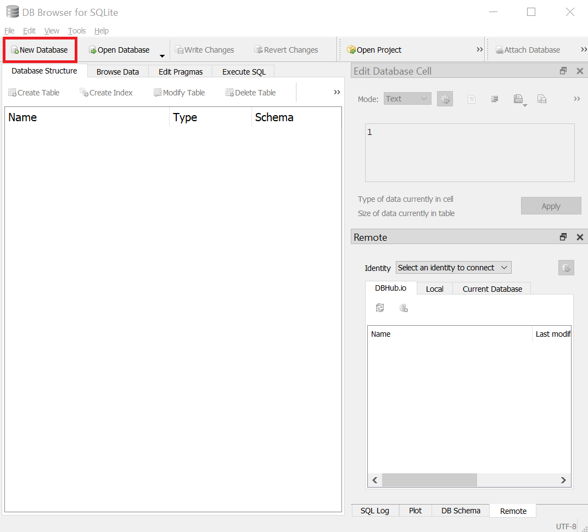
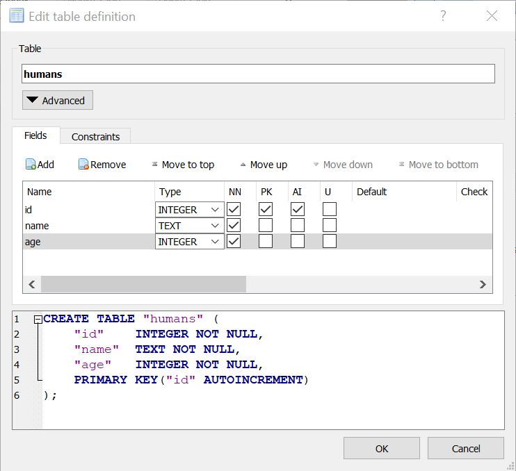
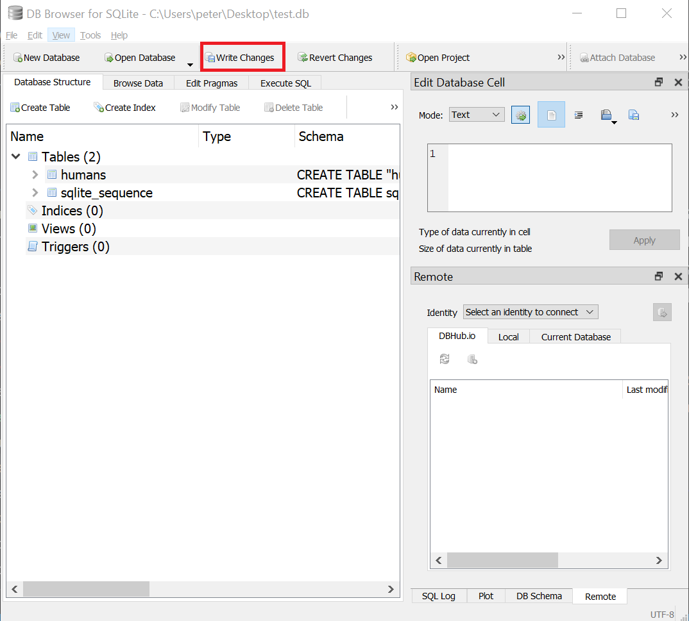
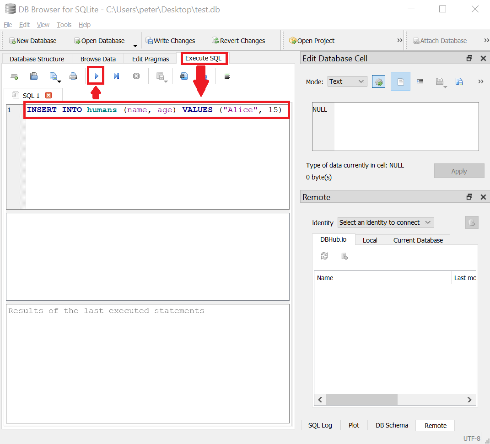
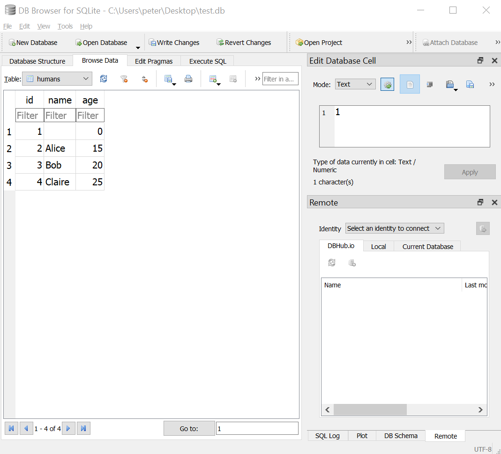
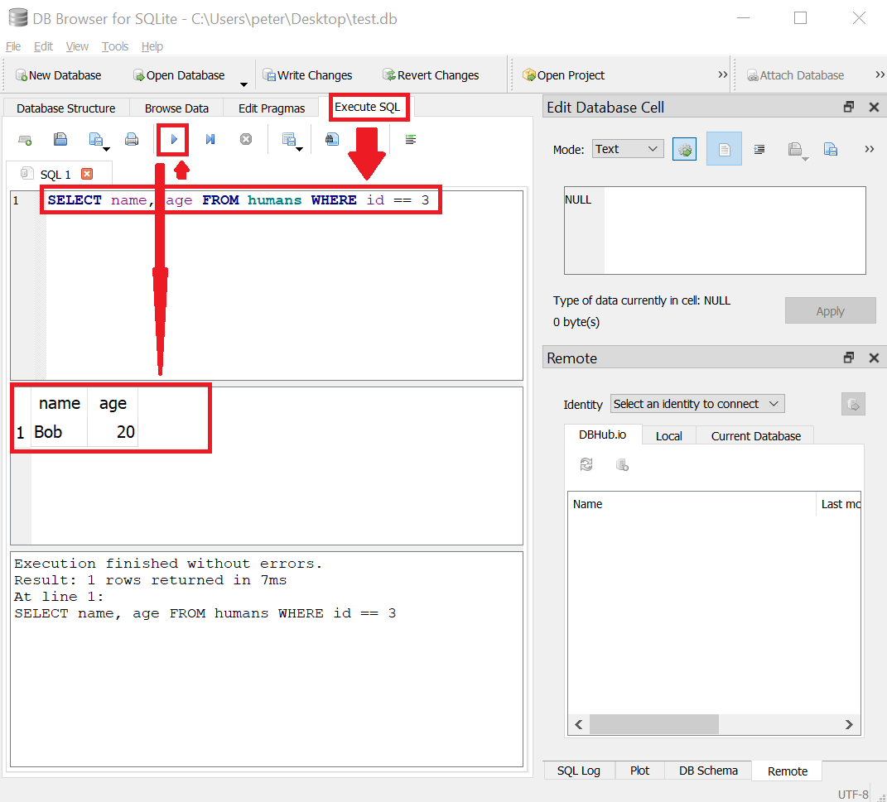

# Exercises
There is no laboratory work in this course, but here are some optional exercises you can try to complete before you start implementing the website in your project work. Completing the exercises will give you a gentler start compared to starting to work on the project directly, so you are strongly recommended to complete them  .

## The CSS Exercise
The goal with this exercise is to practice on the basics in HTML and CSS. Before you start working on it, you are recommended to:

* View the following lectures:
    * [Garrits on campus lecture about CSS 1 & 2](../../lectures/garrit-css/)

---

Your task is to create a portfolio website for yourself featuring your work from the study program.

### 1. Sketch a wireframe
The first task is to draw a wireframe, a rough sketch, how your site should look.

Take a picture of your wireframe and save it as a PDF.

### 2. Set up a GitHub Repository
Create a repository on GitHub that you use for your portfolio.

### 3. Code the HTML structure
Next, you use the wireframe to define the content areas you will need in your HTML code. Use semantic tags.

When you are done, commit, and push your results to your GitHub repository.

### 4. Create a simple CSS
To make your portfolio a bit more impressive, create a CSS-file, link it to your HTML-file, and style the text and color attributes.

When you are done, commit, and push your results to your GitHub repository.

### 5. Layout with more advanced CSS
Use grid and flexbox to generate the layout of your portfolio. Make sure that you plan it responsively.

When you are done, commit, and push your results to your GitHub repository.

### 6. Publish your result with GitHub Pages

When you are satisfied with your portfolio, go to the setting tab on your GitHub repository in the browser, select pages and publish your portfolio. If you like, you can share your link with your classmates.

## The DB Exercise
The goal with this exercise is to practice on basic usage of databases. Before you start working on it, you are recommended to:

* View the following lectures:
    * [Jasmins on campus lecture about DB 1 & 2](../../lectures/jasmine-database/)

---

The DB exercise is about designing the database you will use in your project, and to practice on writing queries you will need to send to it from your web application later.

### Designing the database
The resources you will have on your website should in the end be stored in a relational database. Before storing them in the database, you must design the structure of the database. Start by visualizing the structure of your resources in an ER diagram of your choice. The Database chapter in your report should contain at least one such diagram.

### Creating the database
In the project, the database should be implemented in SQLite 3. To work with an SQLite 3 database, you can use the app [DB Browser for SQLite](https://sqlitebrowser.org/).

In SQLite 3, the entire database is stored in a single file. To create that file in DB Browser for SQLite, click on the `New Database` button, as shown in the <FigureNumber /> below.

<Figure caption="Click on the New Database button in DB Browser for SQLite to create a new SQLite 3 database file.">



</Figure>

After the database file has been created, DB Browser for SQLite prompts you to create a new table in the database. For each resource type your website contains, create a table to store resources of that type in (one at a time). Use the Graphical User Interface to do this (DB Browser will also show you what query to send to the database to create such a table), as shown in <FigureNumber /> below.

<Figure caption="Example of a database table storing information about humans (name and age).">



</Figure>

Here are some guidelines on how to think when choosing what `Type` to select for a field:

* If the field should store only integers (like `123`, `0`, `-45` and `57`), use the type `INTEGER`
* If the field should store numbers that can also be decimals (like `12.34` and `-4.0007`), use the type `REAL`
* If the field should store a sequence of characters (like a string in JavaScript, such as `Alice`, `Sweden` and `Universe`), use the type `TEXT`
* If the field should store only booleans (`true` and `false`), use the type `INTEGER`, and let `0` represent `false`, and `1` represent `true`
* If the field should store only dates/datetimes (like `2010-02-21` and `2022-12-24 15:00:00`), use the type `INTEGER`, and store the [Unix Timestamp](https://www.unixtimestamp.com/) for the dates/datetimes

If you need, use unique constraints and foreign key constraints. 

::: tip Save your changes!
Note that the changes you make to your database (such as creating tables in it) are only stored in-memory in DB Browser for SQLite's. To save the new state of your database back to the file, you have to click on the button `Write Changes`, as shown in <FigureNumber /> below.

<Figure caption="Click on the Write Changes button to store the changes made to the database back to the file.">



</Figure>

:::

### Adding data to the database
In DB Browser for SQLite, go to the `Execute SQL` tab, and write and execute an SQL `INSERT` query to add a post to a table, as shown in <FigureNumber /> below.

<Figure caption="Click on the Execute SQL tab, and then execute an INSERT INTO query to add a post to a table.">



</Figure>

Replace the table name, the column names and the values in the query with your own. Insert a few posts in each table. Then go to the `Browse Data` tab and verify that the tables contains some data, as shown in <FigureNumber /> below.

<Figure caption="Click on the Browser Data tab to view the data in the database.">



</Figure>

### Retrieving data from the database
Go back to the `Execute SQL` tab and try running a few `SELECT` queries to retrieve specific data from the database, as shown in <FigureNumber /> below.

<Figure caption="Run a SELECT query to retrieve data from the database.">



</Figure>

You can try to:

* entirely remove the `WHERE...` part of the query to retrieve all posts from the table
* use a condition like `id < 3` to retrieve multiple posts from the table

## Updating data in the database
To update data in the database, you can send an `UPDATE` query to the database, like the one shown in <FigureNumber /> below.

<Figure caption="Example of an UPDATE query that changes the name to 'Axel' and the age to 30 on all posts in the humans table that have id 1.">

```sql
UPDATE humans SET name = "Axel", age = 30 WHERE id == 1
```

</Figure>

Try sending some `UPDATE` queries to the database to change some posts, and then send some `SELECT` queries to verify that the posts have been updated (or you can cheat and use the `Browse Data` tab).

## Deleting data from the database
To delete data from the database, you can send a `DELETE` query to the database, like the one shown in <FigureNumber /> below.

<Figure caption="Example of a DELETE query that deletes all posts with the name 'Bob' in the humans table.">

```sql
DELETE FROM humans WHERE name == "Bob"
```

</Figure>

Try sending some `DELETE` queries to the database to delete some posts, and then send some `SELECT` queries to verify that the posts have been deleted (or you can cheat and use the `Browse Data` tab).

## The JS Exercise
The goal with this exercise is to practice on the basics in JavaScript. Before you start working on it, you are recommended to:

* View the following videos:
    * [Using Shells](../../lectures/using-shells/)
    * [JavaScript Basics](../../lectures/javascript-basics/)
    * [Asynchronous Programming in JavaScript](../../lectures/asynchronous-programming-in-js/)
    * [Node.js](../../lectures/node-js/)

### Getting started with JavaScript
To run JavaScript code, you need to have a JavaScript engine that can execute the code for you. The runtime environment Node.js comes with a JavaScript engine you can use to do that. Node.js also contains an environment (modules) you can use to access OS protected resources (network functionality, filesystem, etc..

Start by downloading and installing Node.js from [nodejs.org](https://nodejs.org/en). Use the *Current* version if you want to be able to test the latest features. Use the LTS (Long Term Support) version if you plan to later publish real web applications (many web hosting companies only support the LTS version).

After you have installed Node.js, you should be able to start a "Read Eval Print"-Loop (REPL) by running the command `node` in a shell (in Windows you can use the application *Windows PowerShell* as your shell). This command will simply start a loop that:

1. Asks you to enter some JavaScript code.
2. Executes the JavaScript code you entered.
3. Prints the result of the last statement/expression in your entered code.

This is a great way to quickly test how JavaScript works, but for real applications, one writes JavaScript code in a `.js` file, and then asks Node.js to execute the code in this file by running the command `node the-path/to-the/file.js`.

To get acquainted with JavaScript, try solving the problems below. Don't worry too much if you can't solve them; solutions to them will be shown at one of the tutorials.

### Problem 1: `sum()`
Implement the function `sum()`, which should receive an integer as argument, and returns the sum of the integers between 0 and the argument it receives, e.g. `sum(3)` → `0+1+2+3` → `6`.

::: tip Showing output
To print values to the shell, you can use `console.log("This will be printed to the console.")`.
:::

::: danger Return, don't print!
As always, functions computing something should **return** the value they compute, and don't print it directly. Let the caller print the return value instead. 
:::

### Problem 2: `sumOfNumbers()`
Implement the function `sumOfNumbers()`, which should receive an array with numbers as argument, and returns the sum of the numbers in that array, e.g. `sumOfNumbers([5, 2, 8])` → `5+2+8` → `15`.

### Problem 3: `getEvenNumbers()`
Implement the function `getEvenNumbers()` which receives an array with numbers and return a new array with only the even numbers, `getEvenNumbers([4, 7, 3, 6])` → `[4, 6]`.

### Problem 4: `count()`
Create the function `count()` which returns the number of times it has been called (the first time you call the function it should return `1`, the second time you call it it returns `2`, etc.). Sample usage:

```js
const one = count()
const two = count()
const three =  count()
// ...
```

### Problem 5: `makeGetThree()`
Create the function `makeGetThree()` which returns a new function that returns the number `3` when it's called. Sample usage:

```js
const getThree = makeGetThree()
const three = getThree()
```

### Problem 6: `makeCount()`
Create the function `makeCount()` which returns a new `count()` function as specified in Problem 4 each time it's called. Sample usage:

```js
const firstCount = makeCount()
firstCount() → 1
firstCount() → 2
const secondCount = makeCount()
secondCount() → 1
secondCount() → 2
secondCount() → 3
secondCount() → 4
firstCount() → 3
```