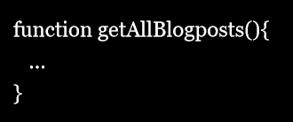

# Report Writing
There are some common mistakes students do the first time they try to write a report describing the project work they've done. In this lecture some of those mistakes are pointed out so you can avoid doing them yourself. But first some important theory to know before you start writing your report.

## What is a project?
Most reports are associated with a project, so you must have a good understanding of what a project is before you write a report on one. [Wikipedia's Project page](https://en.wikipedia.org/wiki/Project) has a long definition of the term, but let us only focus on projects where the goal is to implement some software. A project is always about a problem that should be solved, and the solution (in this case the software) you create should solve that problem.

### The problem
The goal with the software you create is to get people to use it (no point in creating something no one will use). Why would they use it? Because it will help them in some way. So the first thing you should decide in a project work is: *What is the problem people are having that we will try to solve in this project*? Examples of problems are:

* Crossing the road is dangerous.
* Waiting (in line, at a bus stop, at the traffic lights, etc.) is boring AND a waste of time (two problems in one).
* Leaving the children home alone is dangerous (parents are worried about both the house and their children).
* Communicating with someone not speaking your language is hard.
* Remembering when Arsenal plays their next game is hard, and it changes after each game.
* Contacting all players in a hockey team (to notify them of cancelled matches, changed practice hours, etc.) is hard/time consuming.
* Knowing what is cheap and what is expensive in a grocery store is hard.

If you can't come up with a problem on your own, simply ask a friend or a company about problems they're having, and then you can try to solve that problem as your project.

When you have identified the problem to solve, you need to analyze the problem in depth to get a better understanding of it, so you know things like:

* Who are having the problem?
* What is characteristic of those having the problem? E.g.:
    * Are they rich?
    * Do they live in big cities?
    * Are they old?
    * Do they all have driver licenses?
    * How much time are they willing to invest to solve the problem? (e.g. 15 minutes to learn how to use a new app?)
    * Etc.
* When are they having the problem?
* How does the problem impact the rest of their lives?
* Etc.

Analyzing the problem in depth could be a big project itself taking many months, but let us keep things minimal here (you don't have time to do a proper analyze of the project in depth for the project you do in school) and move on.

### The solution
When you have a good understanding of the problem, you need to come up with a solution to the problem. What the solution looks like do of course depends on what the problem is, but in our case the solution will always involve the creation of software. For example, if the problem is *My children has grown up and now I have a lot of small clothes no one in the family can use*, then maybe the solution could be to create a website where people can sell their clothes online to others.

Often you don't only come up with one solution, but many different solutions (coming up with different solutions could be a project itself taking many months), and then you continue to work with the solution you think is the most promising one. When you do, you need to be sure that the people having the problem really think that the solution you pick is a good solution they are willing to use (optimally willing to pay money for 🤑). You can compare your solution to existing solutions to see if your solution seems to be better. For example, parents might now throw/give away their children clothes for free now, but with your solution they would get some money for the clothes, making them prefer your solution. Making a survey and asking the people having the problem if they think your solution is a good idea is of course a very smart thing to do.

When you have decided which solution to go with, you need to realize it (in the previous example implement the website). When you're done realizing the solution, we'll for simplicity consider the project to be over. Real projects could however continue after this. For example, the following could also be part of the project:

* Delivering the solution to a customer.
* Running the solution for a customer.
* Maintaining the solution for a customer.
* Add new functionality to the solution for a customer.
* Fix bugs in the solution.
* ...

## Report structure
Now that you have a basic understanding of what a project is, let's take a look at how we can write a report about one.

Reports describing projects tends to be quite long. Therefore we divide them into chapters, making them a bit more structured. But which chapters should we have? In which order should they be? There's no single correct answer to this, but let's go through an example of a good structure for a report.

### Chapter 1: Introduction
The first chapter in the report should introduce the reader to the project. The reader does so far not know anything about your project, so the first thing you need to explain to the reader is which problem you try to solve and how you intend to solve it.

In this chapter you can think of the reader as an investor with a lot of money, and your goal is to convince the investor that the problem is a serious problem worth solving, and that your solution solves the problem in an excellent way. If you manage to convince the investor of this, she might be willing to invest some money in your project, and you get the money you need to start working on the project and to build the solution. 

In our case the solution is a website, so we need to tell the reader what problem the users of the website are having and then explain how they solve that problem by using the website. A UML use-case diagram is an excellent tool to visualize what the user will be able to do on the website.

::: tip Keep it simple!
Investors are not technical people (just rich and stupid bastards 😉), so avoid using technical terms. Anyone reading your report should be able to understand all the text in the Introduction chapter, even your own grandpa who doesn't even know how to turn off the radio.
:::

### Chapter 2: Solution
So, you have decided on a solution and you've got the money you need to build it from an investor? Great, now we just need to figure out the technical details of how to build the solution. The solution is usually quite complex, so dividing the solution into multiple chapters is usually a good idea, but if the solution is small and simple, a single chapter describing the solution can be enough.

In our case, the solution is a website, so this chapter could be about giving an overview of how we will implement the website. In our case we could explain that a user will use her web browser on her computer to communicate with our web application running on our server, and our server in turn will communicate with our database that runs on yet another server. 

In our case the solution consists of two components we create ourselves:

* The web application
* The database

We have a lot to say about these, but that will be implementation details, and those are probably better described in chapters dedicated to describe these in detail, so this chapter is just about the architecture of the solution (an overview of the solution). This way, readers who don't know much about programming should still be able to read and understand most parts of this chapters.

::: tip Tips!
In our case we describe the architecture of our solution in this chapter, so maybe *Architecture* is a more accurate chapter name than *Solution*? It's your report, you decide!
:::

::: tip Keep it simple!
In the Solution chapter you have to get a little bit more technical compared to the Introduction chapter, but try to keep it simple (avoid mentioning technical implementation details unless it makes sense to mention them here) so most readers can read the chapter and understand the solution overall without being technical experts. Your grandpa should be able to understand most of what you've written, even though [he doesn't know where the any key is](https://www.youtube.com/watch?v=st6-DgWeuos).
:::

### Database
We can use a separate chapter to describe the database component in our solution, so in this chapter we describe everything there is to know about the database, such as:

* What database do we use (MySQL? SQLite?, MariaDB? Etc.)
* What tables do we have in the database?
* What columns do we have in the tables?
* What constraints do we have in our database?
* ...

::: tip Tips!
In this chapter you can expect the reader to know a lot about databases, so don't expect your grandpa to understand much of what you write here. This chapter will primarily be read by other developers working on the project to learn how they should use the database, and by quality assurance people (your boss, your team's quality assurance member, your customer's quality assurance checker, etc.) to verify that your solution has been implemented in a good way.
:::

::: warning Remember!
This chapter is about the database only, so no need to mention anything about the web application in this chapter. 
:::

### Web Application
We can use a separate chapter to describe the web application component in our solution, so in this chapter we describe everything there is to know about the web application, such as:

* Which framework is the web application implemented in?
* How is the source code structured?
* How is authentication and authorization handled?
* How is information about the clients remembered? E.g. cookies, sessions, tokens, etc.
* Which security vulnerabilities has been thought of and is protected against?
* Which libraries is the web application using?
* ...

::: tip Tips!
In this chapter you can expect the reader to know a lot about how web applications work, so don't expect your grandpa to understand much of what you write here. This chapter will primarily be read by other developers working on the project to learn how they should add new features to the web application, and by quality assurance people (your boss, your team's quality assurance member, your customer's quality assurance checker, etc.) to verify that your solution has been implemented in a good way.
:::

::: warning Remember!
This chapter is about the web application only, so no need to describe implementation details of the database. The only thing you need to mention about the database in this chapter is how you communicate with it/connect to it.
:::

### Other chapters
Add whichever other chapters you want that make sense to have. Maybe a chapter describing the website's graphical user interface is good to have? Or maybe designing the graphical user interface is an entire project on its own? Maybe the solution also includes a smartphone app? Then having a chapter explaining the implementation of that app would be good? Or maybe the smartphone app should be described in a separate report? Maybe our solution also includes special days people can come to a house and leave the clothes they want to sell there, and then others can come to the house and buy them? Then a chapter explaining how this works would be good, etc.

## Readers are stupid!
When you write a report you must always remember that you write it for the readers. Each time you hesitate over something, such as:

* Which chapters do I need?
* In which chapter should I write this?
* Do I need a figure to explain this?
* Have I explained this good enough now?

Always think of the reader. Pretend you are a very stupid reader of the report, and that you don't know anything about the project. Then try to answer your question, and then go with the answer you come up with. 

::: tip Your opinion about the report doesn't matter
It doesn't matter whether you think the report is good or bad, what's important is what the readers think of your report, since they are the ones who will read it. To make them think the report is good, you often need to do more work on it than you initially think is necessary, because you know YOUR project work by heart, but the reader doesn't know anything about it, so you need to explain more things than you think.
:::

## Common student mistakes
So, which are the common mistakes students do in their reports and that you should avoid? Here are some of them.

### Non unique solution name
<ReportMistake>
<template v-slot:example-1-bad>

My Website

</template>
<template v-slot:example-1-good>

ShoeSell

</template>
<template v-slot:example-2-bad>

Camera App

</template>
<template v-slot:example-2-good>

CamAppo

</template>
<template v-slot:mistake>

The name of the solution is very general.

</template>
<template v-slot:problem>

The solution is hard to find for people searching on the web, and it's hard to talk about the solution (e.g. Person A: *I like the Camera App, it's a great application*, Person B: *😕 Which camera app?*).

</template>
<template v-slot:solution>

Use a more unique name on your solution. Compare to *Google*, *Netflix*, *Spotify*, etc. Hard to come up with a unique name? Use a [project name generator](https://www.google.se/search?q=project+name+generator).

</template>
</ReportMistake>

### Weird solution name
<ReportMistake>
<template v-slot:example-1-bad>

Jukioperlatino

</template>
<template v-slot:example-1-good>

Fnelly

</template>
<template v-slot:example-2-bad>

dsfkjs

</template>
<template v-slot:example-2-good>

Klanga

</template>
<template v-slot:mistake>

The name of the solution is too strange.

</template>
<template v-slot:problem>

People can't easily talk about the solution, and remembering the name is extremely hard.

</template>
<template v-slot:solution>

Use an easier (and possibly shorter) name. Compare to *Google*, *Netflix*, *Spotify*, etc..

</template>
</ReportMistake>

### Components used before defined
<ReportMistake>
<template v-slot:example-1-bad>

(first time *database* is mentioned in the report)

The database runs on a separate server.

</template>
<template v-slot:example-1-good>

(first time *database* is mentioned in the report)

The website has a database it uses to store the resources in.

</template>

<template v-slot:mistake>

The text refers to components before they have been introduced.

</template>
<template v-slot:problem>

The reader has no idea about what you refer to (which database *The database* in the example above refers to), nor that it's part of the solution.

</template>
<template v-slot:solution>

Introduce components before you use them.

</template>
</ReportMistake>

### Ambiguous explanations
<ReportMistake>
<template v-slot:example-1-bad>

The solution consists of a backend application and a frontend application. The application is...

</template>
<template v-slot:example-1-good>

The solution consists of a backend application and a frontend application. The frontend application is...

</template>
<template v-slot:example-2-bad>

Any user can login to the application and upload photos.

</template>
<template v-slot:example-2-good>

In the application any user can create and login to an account, and thereafter upload photos belonging to the account they logged in to.

</template>
<template v-slot:mistake>

The text is ambiguous, i.e. can be read in many different ways.

</template>
<template v-slot:problem>

The reader doesn't know what the text actually means and have to guess what the intended meaning is. [It can end really bad for you.](https://www.xkcd.com/169/)

</template>
<template v-slot:solution>

Be explicit about what you mean. Don't leave any room for different interpretations anywhere in the report.

</template>
</ReportMistake>

### Inconsistent terms
<ReportMistake>
<template v-slot:example-1-bad>

The solution consists of an Android application. The app is designed... The software securely communicates with...

</template>
<template v-slot:example-1-good>

The solution consists of an Android application. The application is designed... The application securely comminutes with...

</template>
<template v-slot:mistake>

The text uses different terms to refer to the same thing.

</template>
<template v-slot:problem>

It's hard for the reader to read the text, and the reader gets unsure about if you refer to the same thing or two different things when you refer to it by different terms.

</template>
<template v-slot:solution>

Be consistent with which terms you use.

</template>
</ReportMistake>

### Making text stand out
<ReportMistake>
<template v-slot:example-1-bad>

"<b><i><u>Pangoga</u></i></b>" is a platform that...

</template>
<template v-slot:example-1-good>

<i>Pangoga</i> is a platform that...

</template>
<template v-slot:mistake>

Some of the text stands out too much.

</template>
<template v-slot:problem>

The text is harder to read when a word stands out too much from the rest of the text. For example, when you read this paragraph chances are you looked at this smiley 😃 before you were supposed to, stealing your focus from the text. It can even steal your focus when you read this text, which appears after it.

</template>
<template v-slot:solution>

Don't make the text stand out too much. Just using italic is enough in most cases.

</template>
</ReportMistake>

### Acronyms without explanations
<ReportMistake>
<template v-slot:example-1-bad>

The GUI has been...

</template>
<template v-slot:example-1-good>

The Graphical User Interface (GUI) has been...

</template>

<template v-slot:mistake>

The text uses acronyms without explaining what they mean.

</template>
<template v-slot:problem>

The reader doesn't know what the acronym stands for and doesn't understand the text.

</template>
<template v-slot:solution>

Always explain what an acronym stands for the first time you use it in the report.

</template>
</ReportMistake>

### Acronyms are introduced wrong
<ReportMistake>
<template v-slot:example-1-bad>

The Graphical User Interface (from here on written as GUI) has been...

</template>
<template v-slot:example-1-good>

The Graphical User Interface (GUI) has been...

</template>

<template v-slot:mistake>

The standard notation for introducing acronyms has not been used.

</template>
<template v-slot:problem>

The standard notation is very short, if you use another notation the reader needs to do more work to read it. The reader also needs to learn your specific way of introducing acronyms, which is an extra effort for the reader.

</template>
<template v-slot:solution>

Stick to using the standard notation for introducing acronyms, or (second best) don't introduce them at all.

</template>
</ReportMistake>

### Repeating information
<ReportMistake>
<template v-slot:example-1-bad>

The database contains three tables: accounts, blogposts and comments. [...] The three type of resources in the database are accounts, blogposts and comments. [...] The resources stored in the database (accounts, blogposts and comments) are all validated before they are inserted.

</template>
<template v-slot:example-1-good>

The database contains three tables: accounts, blogposts and comments.

</template>
<template v-slot:mistake>

The same type of information is mentioned multiple times in the report, often across many different chapters.

</template>
<template v-slot:problem>

Making changes in the future will be hard, since the report needs to be updated at multiple places (and you will probably forget to update the report at all places, which makes it inconsistent). The report does also have a poor structure if the same information is described at multiple places. For example, if the user want to find this specific information and it's written at multiple different places, it is not obvious where in the report the user should start searching for it. Also, the reader doesn't get any new information by reading the same information multiple times, wasting the reader's time.

</template>
<template v-slot:solution>

Don't repeat the same information; each thing worth mentioning should only be mentioned once, and it should be obvious where in the report (which chapter) each thing is described. If it's not obvious you probably need to re-structure your report somehow.

</template>
</ReportMistake>

### Chapters start with figures
<ReportMistake>
<template v-slot:example-1-bad>

(in the beginning of a chapter)

[Actual Figure]

The figure above shows...

</template>
<template v-slot:example-1-good>

(in the beginning of a chapter)

The figure below shows...

[Actual Figure]

</template>
<template v-slot:mistake>

The first thing in the chapter is a figure.

</template>
<template v-slot:problem>

When the reader starts reading the chapter, she has no idea why there's a figure there, or why she should look at it.

</template>
<template v-slot:solution>

Always start a chapter with text, and if you want the reader to immediately look at a figure, tell the reader to do that the first thing you write in the chapter.

</template>
</ReportMistake>

### Chapters missing figures
<ReportMistake>
<template v-slot:example-1-bad>

The default profile avatar is a picture of a human. Only the head is shown, the human is almost smiling and has blue ring above the head.

</template>
<template v-slot:example-1-good>

The default profile avatar is shown in Figure 1 below.

👼\
Figure 1: The default avatar profile.

</template>
<template v-slot:mistake>

No figures are used in a chapter; the chapter only consists of text.

</template>
<template v-slot:problem>

Figures are much easier to understand and faster to interpret than reading a long wall of text. It's also easier to remember a figure than it is to remember something described in text. It's also easier to have a discussion about a figure than it is about something only described in text. Each user reading a text creates their own image in their head about what they're reading, by using a figure all readers get the same picture in their head.

</template>
<template v-slot:solution>

Use many figures in your chapters. 

</template>
</ReportMistake>

### Figures don't have captions
<ReportMistake>
<template v-slot:example-1-bad>

🐵

</template>
<template v-slot:example-1-good>

🐵\
Figure 1: Picture of Peter's pet DK.

</template>
<template v-slot:mistake>

Figures don't have captions.

</template>
<template v-slot:problem>

Without a descriptive caption, the reader is not always sure what the figure represents, nor why it's there.

</template>
<template v-slot:solution>

Each figure should always have a descriptive caption that explains what the figure shows, no matter how easy it is to interpret it.

</template>
</ReportMistake>

### Captions aren't descriptive
<ReportMistake>
<template v-slot:example-1-bad>

🐵\
Figure 1: A monkey.

</template>
<template v-slot:example-1-good>

🐵\
Figure 1: What students transforms to if they eat too many bananas (a monkey).

</template>
<template v-slot:mistake>

The caption doesn't describe the figure good enough.

</template>
<template v-slot:problem>

The user doesn't know why the figure is there, how it's relevant to the text nor how to interpret the figure.

</template>
<template v-slot:solution>

Use a descriptive caption. If the figure consists of components, colors, arrows, etc., describe what each component, color, arrow, etc. represent.

</template>
</ReportMistake>

### Figures don't have figure numbers
<ReportMistake>
<template v-slot:example-1-bad>

🐵

</template>
<template v-slot:example-1-good>

🐵\
Figure 1: What humans looked like just before we evolved from apes.

</template>
<template v-slot:mistake>

Figures don't have figures number.

</template>
<template v-slot:problem>

You can't refer to a specific figure from the text, and the reader can't easily send the report to a friend and ask the friend to look at a specific figure in the report.

</template>
<template v-slot:solution>

Give each figure a unique figure number.

</template>
</ReportMistake>

### Figures aren't referred to properly
<ReportMistake>
<template v-slot:example-1-bad>

Some text that doesn't mention the figure above/below at all...

</template>
<template v-slot:example-1-good>

Figure 5 below shows...

</template>
<template v-slot:example-2-bad>

The figure below shows...

</template>
<template v-slot:example-2-good>

Figure 5 below shows...

</template>
<template v-slot:mistake>

The text refers to figures without using their figure numbers.

</template>
<template v-slot:problem>

If you don't refer to the figure from the main text at all, it's unclear when and why the reader should look at the figure. If you refer to a figure without using the figure numbers it's often ambiguous which figure you refer to. For example, *the figure below* could refer to any of all the figures below the text, which are quite many in the beginning of the report.

</template>
<template v-slot:solution>

Always refer to figures using their figure numbers.

</template>
</ReportMistake>

### The figure is far away
<ReportMistake>
<template v-slot:example-1-bad>

(at the begging of the chapter)

Figure 4 at the end of the chapter shows...

(at the end of the chapter)

[Actual Figure 4]

</template>
<template v-slot:example-1-good>

(at the begging of the chapter)

Figure 4 below shows...

[Actual Figure 4]

...

</template>
<template v-slot:mistake>

The text refers to a figure, and the figure is far away.

</template>
<template v-slot:problem>

The reader needs to stop reading, scroll to the figure, interpret the figure, and then scroll back to the text. This is inconvenient, and the reader loses her concentration, making the report very hard to read.

</template>
<template v-slot:solution>

Place figures close to the text referring to the figure.

</template>
</ReportMistake>

### Putting the figures at the end
<ReportMistake>
<template v-slot:example-1-bad>

...

(at the end of the chapter)

Figure 8 below gives an overview of the architecture.

[Actual Figure 8]

</template>
<template v-slot:example-1-good>

(at the begging of the chapter)

Figure 8 below gives an overview of the architecture.

[Actual Figure 8]

...

</template>
<template v-slot:mistake>

The figures are put after most of the text, making the reader first read the text, and then look at the figures.

</template>
<template v-slot:problem>

Reading text is hard and takes time, interpreting figures is easy and can be done fast. 

</template>
<template v-slot:solution>

Put figures (often) at the beginning of the text. They give a good understanding of the big picture, and then the reader can read the text to learn the details.

</template>
</ReportMistake>

### Images display text
<ReportMistake>
<template v-slot:example-1-bad>

Figure 5 below is a screenshoot of the getAllBlogposts() function.



</template>
<template v-slot:example-1-good>

Figure 5 below contains the code for the getAllBlogposts() function.

```
function getAllBlogposts(){
   ...
}
```

</template>
<template v-slot:mistake>

Code (text in general) is shown as images/screenshots instead of text.

</template>
<template v-slot:problem>

Searching does not work, zooming works poorly (images have limited resolution) and copy-pasting the text doesn't work.

</template>
<template v-slot:solution>

Always display code (and text) as text, not as images.

</template>
</ReportMistake>

### Use contractions
<ReportMistake>
<template v-slot:example-1-bad>

If the client doesn't receive back a response within 5 seconds...

</template>
<template v-slot:example-1-good>

If the client does not receive back a response within 5 seconds...

</template>
<template v-slot:mistake>

Contractions (didn't, can't, won't, etc.) are used.

</template>
<template v-slot:problem>

Contractions should not be used in reports.

</template>
<template v-slot:solution>

Never use contractions in a report.

</template>
</ReportMistake>

### Use I, we, etc.
<ReportMistake>
<template v-slot:example-1-bad>

We use the database MySQL to...

</template>
<template v-slot:example-1-good>

A MySQL database is used to...

</template>
<template v-slot:mistake>

Words such as I, we, us, our, etc. are used.

</template>
<template v-slot:problem>

The reader doesn't know who *I*/*we*/etc. are. Also, the report should often describe a solution/product, and that should be independent of who created it, so there should be no need to use I/we in a report unless you express you own opinions/decisions. Also, if you write <i>This application is developed and maintained by me.</i>, then you need to update the report if you give away the project to someone else or if you invite someone else to work on the project with you.

</template>
<template v-slot:solution>

Avoid using I, we, etc. unless you are expressing your own opinions/decisions.

</template>
</ReportMistake>

### Don't properly mark up the text
<ReportMistake>
<template v-slot:mistake>

A bold paragraph is used as a header.

</template>
<template v-slot:problem>

The header won't appear in the table of content, the reader gets unsure about whether the bold paragraph is a paragraph or a header. You also risk ending up with the bold paragraph at the end of one page, and the text belonging to it on the top of next page.

</template>
<template v-slot:solution>

Properly mark up the text: mark headers as headers, paragraphs as paragraphs, etc.

</template>
</ReportMistake>

### Inconsistent usage of white-space
<ReportMistake>
<template v-slot:example-1-bad>

First paragraph...<br><br>Second paragraph...<br>Third paragraph...

</template>
<template v-slot:example-1-good>

First paragraph...<br><br>Second paragraph...<br><br>Third paragraph...

</template>
<template v-slot:mistake>

Different parts of the report use white-space differently around headers, lists, paragraphs, tables, figures, etc.

</template>
<template v-slot:problem>

It's hard to see the structure of the report when white-space is used inconsistently. 

</template>
<template v-slot:solution>

Be consistent with how you use white-space throughout the entire report.

</template>
</ReportMistake>

### Describe things where they shouldn't be described
<ReportMistake>
<template v-slot:example-1-bad>

The database chapter describes parts of the web application (e.g. how the web application communicates with the database, or how the source code in the web application that communicates with the database has been structured, etc.).

</template>
<template v-slot:example-1-good>

The database chapter only describes the database, the web application is not mentioned at all since the database doesn't use the web application.

</template>
<template v-slot:mistake>

One thing is described in a chapter where it doesn't make sense to describe it.

</template>
<template v-slot:problem>

When the reader is looking for some specific information, she won't find it in the chapter she expects to find it in. And when she wants to only learn about a specific thing by reading the corresponding chapter, she's also forced to read the unrelated thing you describe there.

</template>
<template v-slot:solution>

In a chapter, only describe the thing the chapter is about.

</template>
</ReportMistake>

### Spelling names wrong
<ReportMistake>
<template v-slot:example-1-bad>

The graphical user interface is implemented in html.

</template>
<template v-slot:example-1-good>

The graphical user interface is implemented in HTML.

</template>
<template v-slot:example-2-bad>

The framework express is used to implement the web application.

</template>
<template v-slot:example-2-good>

The framework Express is used to implement the web application.

</template>
<template v-slot:mistake>

The spelling of names (languages, frameworks, libraries, etc.) are wrong.

</template>
<template v-slot:problem>

It's harder for the reader to read the text, and the reader is unsure what you refer to.

</template>
<template v-slot:solution>

Use the correct spelling of names. Feel free to name your own things whatever you want, but be sure to use the correct names others have given their solutions.

</template>
</ReportMistake>

### Describing others work
<ReportMistake>
<template v-slot:example-1-bad>

The graphical user interface is implemented in HTML. HTML is a markup language that contains the tags &lt;a&gt;, &lt;br&gt;, &lt;p&gt;, &lt;link&gt;...

</template>
<template v-slot:example-1-good>

The graphical user interface is implemented in HTML<sup>[1](https://html.spec.whatwg.org/)</sup>. HTML is a markup language used to define what different type of text represents, such as headers and paragraphs.

</template>
<template v-slot:example-2-bad>

The web browser communicates with the web application by sending HTTP requests to it. HTTP is a protocol built on top of TCP, which is a transfer protocol for sending small packages (messages) from one computer to another. ...

</template>
<template v-slot:example-2-good>

The web browser uses HTTP<sup>[1](https://tools.ietf.org/html/rfc2616)</sup> to communicate with the web application. In HTTP, the client (the web browser) simply sends an HTTP request to the server (the web application), telling the server what it wants it to do, then the server do that and sends back an HTTP response.

</template>
<template v-slot:mistake>

Techniques used to implement the solution (for example HTTP, HTML, CSS, Express, etc.) has been described in detail.

</template>
<template v-slot:problem>

The report should be about the solution you have created, not details about the techniques you have used to implement it. Many readers do probably already know these techniques, and reading about them is no fun, and you describing them in vain wastes your time.

</template>
<template v-slot:solution>

Only describe what's unique to your solution. You can describe the techniques you are using (HTTP, HTML, etc.) very short and briefly, but for more information about these, provide references to their specifications/documentations and let the reader read more about them there instead. No use in you writing a tutorial about how other techniques work.

</template>
</ReportMistake>