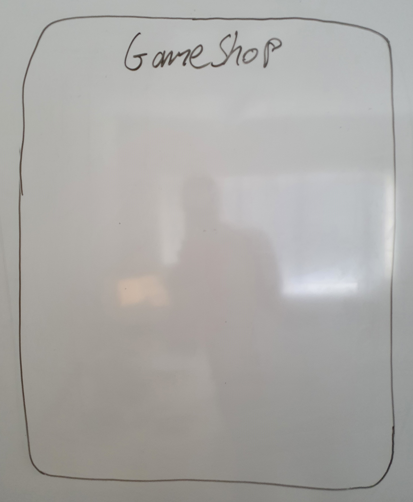
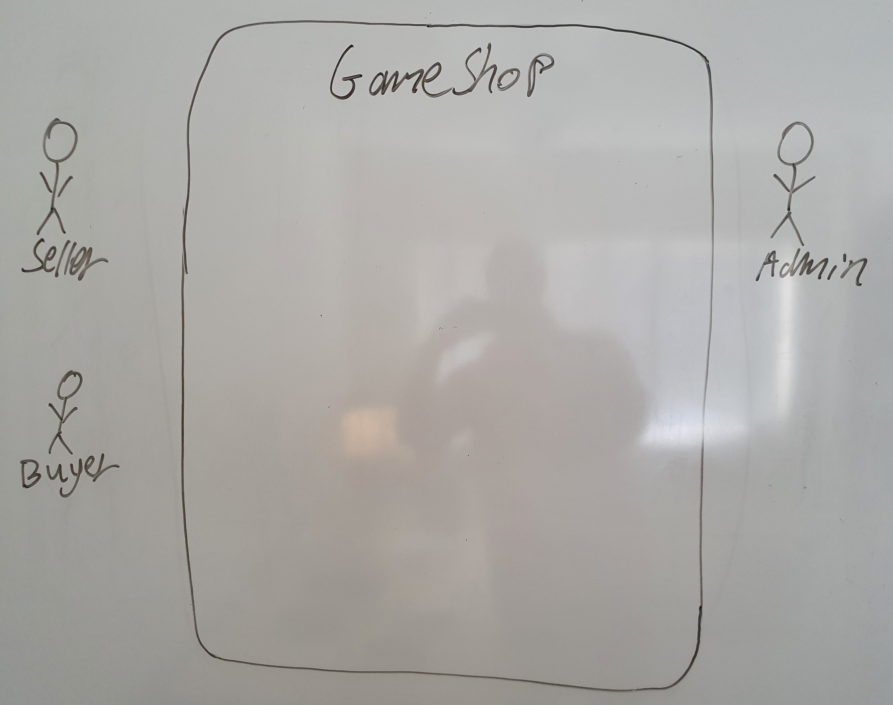
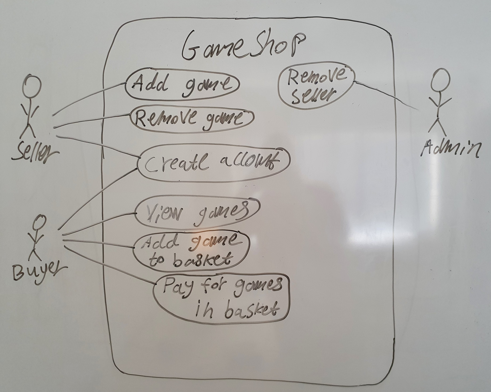
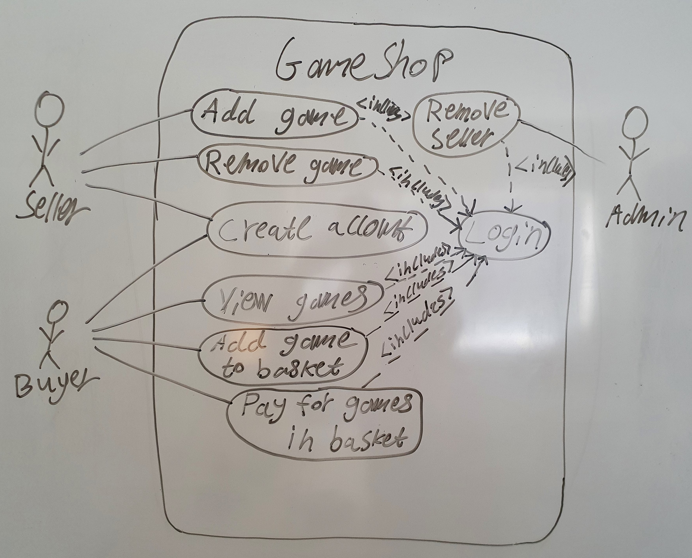
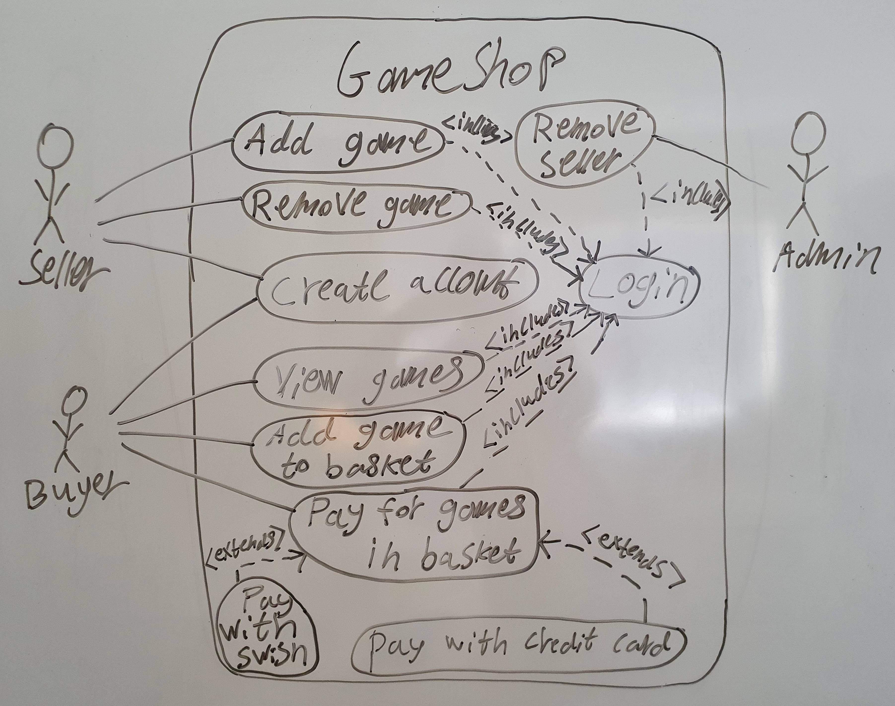

# UML Use-Case Diagrams
This lecture teaches you how to draw UML Use-Case Diagrams, and why they are important to draw.


## Why?
So, why waste time on learning how to draw use-case diagrams? What good do they do? Turns out they actually solve a quite big and common problem in big projects.

When building a system, there are many participants involved. At least, there is:

* the customer who wants to have the system built
* the developer who is responsible for building the system

Most often the the customer is represented by many different type of end-users (the people who will use the system after it has been built), and it usually takes too long time to implement the system by a single developer, so usually there are multiple developers implementing it. So, when building most systems, many different humans are involved.

Unfortunately, we humans are individuals, so we all have our own idea of how the system should work in the end, and what functionality it should contain. A customer saying *I need a system for selling groceries* might expect the system to contain special functionality for those that are allergic, so they can hide the groceries they can't eat, but the developers implementing the system might not even know that some people are allergic to some groceries, so they never even considered that functionality at all. And in the end, the developers deliver a system that doesn't fulfills the requirements the customer had, and the customer doesn't want to pay for that, so everybody are unhappy with the project:

* the customer is unhappy because she didn't get the system she needs
* the developers are unhappy because they wasted a lot of time on building a system no one wants to pay for

Avoiding such a situation is extremely important for a project to be successful. So, how can we avoid it? *By clearly specifying what functionality the system should contain in the beginning of the project.* One way to specify that is by drawing a use-case diagram. But first, let's go through what use-cases are.


## Use-cases
So, the first step in a project is to agree on what functionality the system you will create should contain. This functionality is often expressed as use-cases. A *use-case* is a description of one operation a user of the system needs to be able to use the system for.

::: tip Example
If the system is a shopping website, then the following use-cases might be good to have:

* Add product
* View new orders
* Mark order as handled
* Find product
* Add product to basket
* Remove product from basket
* Checkout products in basket
* Etc.
:::

Each use-case describes one functionality the system needs to contain, and all use-cases together describes the functionality of the entire system.

::: warning Naming the use-case
The name of the use-case should be a goal the user want to achieve. *Enter product name* is not a good use-case, because no user is happy with just entering a product name into the system. *Delete product by name* is better, because the name reflects the goal is to delete a product by entering its name.

Similarly, *Login* is not a good use-case, because the user hasn't achieved any useful accomplishment by just logging in. Logging in is rather a step part of other use-cases.
:::

Now when the functionality of the system has been specified as use-cases, all involved in the project will have the same understanding of what functionality the system needs to contain 😃 Serious projects also describe use-cases in much more details than just naming them, but we'll settle with just naming them.


## Actors
Most often, a system have different type of users.

::: tip Example
In the previous example about the shopping website, we had the following two type of users:

* *Admin*/*Owner*, who should add new products to the website, view new orders, etc.
* *Customer*, who should find products, add products to basket, etc.
:::

Often, a system have many more than just 2 different type of users.

::: tip Example
If the shopping website is very big, there are probably also specialized people using the system, such as:

* *Accountant*, who needs to deal with taxes, etc., and therefor need to be able to view how many of each product that has been sold, etc.
* *Deliverer*, who delivers the ordered products to the customer, and need to see which the next unhandled order is, etc.
* Etc.
:::

These different type of users are called *actors*, and when specifying a use-case, you should also clearly indicate which actors that will do the use-case. This is very important, because if you by accident end up having a use-case no actor wants to do, then you add functionality to the system no user will ever use, which is a embarrassing 😅

::: danger Naming actors
Don't name an actor *User*. The name of the actor should reflect what type of user it is, so try to come up with a more specific name. If the system is going to be used by an organization, they typically have already come up with suitable names for actors, such as *Boss*, *Developer*, *Scheduler*, *UX Expert*, etc.

Using *User* is bad even if your system only has one actor. Because it might be that it only has one actor TODAY, but one year from now you might need to add more functionality to the system, introducing new actors, and then you can't call one of them for *User*, because they are all users of the system! So, use good descriptive names already from the beginning, even if you only have one actor.
:::

An actor doesn't have to be a human. If another system will be using our system, that other system will be an actor too!

::: danger Implementation details aren't actors!
Don't show implementation details as actors. For example, if the system is an Android application storing data in a Firestore database, some students thinks their system is only the Android application, and that the Firestore database is an actor. That's not the case; the system includes both the Android application and the Firestore database, and the Firestore database is an implementation detail of the system, and not an actor using the system.

If your new system is used by/uses an **existing** system, then that existing system becomes an actor.
:::


## Drawing the Diagram
So, now when you know what use-cases and actors are, let's take a look at how we can visualize them in a use-case diagram!


### 1. Adding the system
The first thing you should draw in a use-case diagram is the system. It is represented by a big rectangle. The borders of the rectangle is called *the system boundaries*. What goes inside the rectangle is part of the system, and what goes outside is not part of the system. 

Centered at the top of the rectangle you should write the name of the system, so the reader knows which system it is.

::: tip Example

Example of a use-case diagram containing only the boundaries of a system called *GameShop*.



:::


### 2. Adding actors
The actors are added as symbols outside the system. When the actor is a human, you typically visualize it as a stickman, like 웃. If the actor is another system, then you can use the logo of that system, or whatever you think is the best way to indicate which system it is. Below the stickman/logo you write the name of the actor.

::: tip Example

Example of a use-case diagram containing the boundaries and actors of a system called *GameShop*.



:::


### 3. Adding use-cases
Each use-case is added as an oval inside the system boundaries. In the center of the oval, write the name of the use-case. Then, for each actor that will do or is involved in a use-case, draw a line from that actor to the use-case.

::: tip Example

Example of a use-case diagram containing the boundaries, actors and use-cases of a system called *GameShop*.



:::

### Premium features
To make the use-case diagram even more useful you can use relations, like *includes* and *extends*. Below are descriptions of what these are, and examples of how they can be used and implemented in pseudocode.

::: danger Don't overuse relations!
The goal with use-case diagram is to visualize who needs to use which functionality of the system in a way that's very easy to interpret. The more relations you add to the diagram, the harder it will be to interpret it, so don't add relations just because you can. Especially, don't try to add relations just to have some 🤦
:::

#### Using includes
When different use-cases partly require the user to do the same thing, you can extract that common thing and put it in a new use-case, and then use a dashed *includes* arrow from the original use-case to the new one. That includes arrow should be read as *Doing the original use-case also includes doing the use-case the arrow points to*.

Optimally the new extra use-case is a good use-case on it's own (i.e. a goal on its own the user is happy with achieving). In that case, you can also add a line between the actor to the new extra use-case.

::: tip Example

Example of how to use includes relations.



Note in the diagram above how easy it is to spot when something seems weird; should users really have to login to be able to view games? Shouldn't users be able to view games without being logged in? Thanks to our great visualization of the functionality in a use-case diagram, anyone can easily spot things that seems weird 🙂

:::

When use-cases are implemented as functions, a use-case that includes another use-case can simply call that other function to carry out the other use-case, as shown in the pseudocode below.

```js
function login(){
	
	username = enterText()
	password = enterText()
	
	account = getAccountFromDatabase(username, password)
	
	return account
	
}

function createBlogpost(){
	
	loggedInAccount = login() // Includes relation.
	
	title = enterText()
	content = enterText()
	
	storeBlogpostInDatabase(loggedInAccount.id, title, content)
	
}

function deleteOwnBlogpost(){
	
	loggedInAccount = login() // Includes relation.
	
	blogpostId = enterText()
	blogpost = getBlogpostFromDatabase(blogpostId)
	
	if(blogpost.accountId == loggedInAccount.id){
		removeBlogpostFromDatabase(blogpost)
	}
	
}
```

When use-cases are implemented as classes, a use-case that includes another use-case can simply make use of that other class, as shown in the pseudocode below.

```js
class LoginUseCase{
	
	account: null
	
	execute(){
		
		username = enterText()
		password = enterText()
		
		this.account = getAccountFromDatabase(username, password)
		
	}
	
}

class CreateBlogpostUseCase{
	
	execute(){
		
		loginUseCase = new LoginUseCase() // Includes relation.
		loginUseCase.execute()
		
		title = enterText()
		content = enterText()
		
		storeBlogpostInDatabase(loginUseCase.account.id, title, content)
		
	}
	
}

class DeleteOwnBlogpostUseCase(){
	
	execute(){
		
		loginUseCase = new LoginUseCase() // Includes relation.
		loginUseCase.execute()
		
		blogpostId = enterText()
		blogpost = getBlogpostFromDatabase(blogpostId)
		
		if(blogpost.accountId == loginUseCase.account.id){
			removeBlogpostFromDatabase(blogpost)
		}
		
	}
	
}
```

#### Using extends
When a use-case can be carried out in different ways, and all the ways have some part of their ways in common, you can have one use-case for that common part, and then let the other use-cases with their unique parts extend the first one. 

::: tip Example

Example of how to use extends relations.



:::

When use-cases are implemented as functions, a use-case that extends another use-case can be implemented as a function call to carry out the common part, as shown in the pseudocode below.

```js
function createAccount(){
	
	// Base functionality for all accounts.
	age = enterNumber()
	
	partialAccount = {
		age
	}
	
	return partialAccount
	
}

function createAccountWithUsernameAndPassword(){
	
	partialAccount = createAccount() // Extends relation.
	
	username = enterText()
	password = enterText()
	
	storeAccountInDatabase(partialAccount.age, username, password)
	
}

function createAccountWithGoogle(){
	
	partialAccount = createAccount() // Extends relation.
	
	googleAccount = loginWithGoogle()
	
	storeAccountInDatabase(partialAccount.age, googleAccount)
	
}
```

When use-cases are implemented as classes, one use-case extending another use-case can be implemented through inheritance, as shown in the pseudocode below.

```js
class CreateAccountUseCase{
	
	age: -1
	
	execute(){
		// Base functionality for all accounts.
		age = enterNumber()
	}
	
}

class CreateAccountWithUsernameAndPasswordUseCase
      extends CreateAccountUseCase{ // Extends relation.
	
	execute(){
		super.execute() // Extends relation.
		
		username = enterText()
		password = enterText()
		
		storeAccountInDatabase(this.age, username, text)
		
	}
	
}

class CreateAccountWithGoogleUseCase
      extends CreateAccountUseCase{ // Extends relation.
	
	execute(){
		super.execute() // Extends relation.
		
		googleAccount = loginWithGoogle()
		
		storeAccountInDatabase(this.age, googleAccount)
		
	}
	
}
```